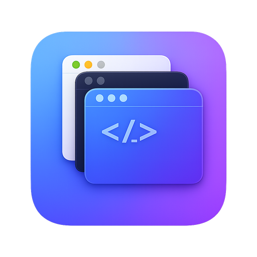

<p align="center">
  
</p>

<h1 align="center">Editor Tab Manager</h1>

<p align="center">
  A lightweight macOS desktop app that provides a persistent tab bar for managing multiple code editor windows.
</p>

<p align="center">
  
  
  <a href="https://github.com/884js/editor-tab-manager/releases"></a>
  <a href="https://github.com/884js/editor-tab-manager/releases"></a>
  <a href="https://github.com/884js/editor-tab-manager/stargazers"></a>
  <a href="LICENSE"></a>
</p>

---

<!-- TODO: Add screenshot -->
<!--
<p align="center">
  
</p>
-->

## Table of Contents

- [Why This App?](#why-this-app)
- [Features](#features)
- [Supported Editors](#supported-editors)
- [Installation](#installation)
- [Usage](#usage)
  - [Keyboard Shortcuts](#keyboard-shortcuts)
  - [Claude Code Integration](#claude-code-integration)
  - [Settings](#settings)
- [Development](#development)
- [Architecture](#architecture)
- [License](#license)

---

## Why This App?

When working on multiple projects simultaneously, editor windows pile up and finding the right one becomes a hassle.

**Editor Tab Manager** displays all your editor windows in a browser-like tab bar. Switch instantly with `Cmd+1` through `Cmd+9` shortcuts, dramatically improving your workflow efficiency.

### Why not Multi-root Workspaces?

While [multi-root workspaces](https://code.visualstudio.com/docs/editing/workspaces/multi-root-workspaces) can handle multiple projects, separate windows provide a clear "one window = one project" boundary that helps you stay focused — and it works the same way across VSCode, Cursor, and Zed.

## Features

- **Tab Bar UI** - View all editor windows in an always-visible tab bar
- **Quick Switching** - Switch tabs instantly with `Cmd+1` through `Cmd+9`
- **Multi-Editor Support** - Works with VSCode, Cursor, and Zed
- **Custom Tab Order** - Drag and drop to reorder tabs; order persists across restarts
- **Claude Code Integration** - Badge notifications for Claude Code task status
- **Desktop Notifications** - Get notified when Claude Code finishes generating while you're in another project
- **Multi-language Support** - Japanese and English UI with automatic system language detection

## Supported Editors

| Editor | Status |
|--------|--------|
| Visual Studio Code | ✅ Supported |
| Cursor | ✅ Supported |
| Zed | ✅ Supported |

## Installation

### Download

Download the latest `.dmg` file from the [Releases page](https://github.com/884js/editor-tab-manager/releases) and install it.

### Build from Source

#### Prerequisites

- macOS
- [Node.js](https://nodejs.org/) 18+
- [pnpm](https://pnpm.io/)
- [Rust](https://rustup.rs/)

#### Steps

```bash
# Clone the repository
git clone https://github.com/884js/editor-tab-manager.git
cd editor-tab-manager

# Install dependencies
pnpm install

# Run in development mode
pnpm tauri dev

# Build for production
pnpm tauri build
```

## Usage

### Keyboard Shortcuts

| Shortcut | Action |
|----------|--------|
| `Cmd+1` - `Cmd+9` | Switch to tab N |
| `Cmd+Shift+T` | Open new editor window |
| `Cmd+W` | Close current tab |

### Menu Bar

The app runs in the menu bar. Click the tray icon to access settings or quit the app.

### Claude Code Integration

Integrates with [Claude Code](https://claude.ai/code) to display task status badges on the tab bar.

#### Setup

To use this feature, you need to configure hooks in Claude Code.

Add the following to your `~/.claude/settings.json`:

```json
{
  "hooks": {
    "UserPromptSubmit": [
      {
        "hooks": [{
          "type": "command",
          "command": "echo \"g $CLAUDE_PROJECT_DIR\" >> /tmp/claude-code-events"
        }]
      }
    ],
    "PostToolUse": [
      {
        "hooks": [{
          "type": "command",
          "command": "echo \"g $CLAUDE_PROJECT_DIR\" >> /tmp/claude-code-events"
        }]
      }
    ],
    "Notification": [
      {
        "matcher": "permission_prompt",
        "hooks": [{
          "type": "command",
          "command": "echo \"w $CLAUDE_PROJECT_DIR\" >> /tmp/claude-code-events"
        }]
      }
    ],
    "Stop": [
      {
        "hooks": [{
          "type": "command",
          "command": "echo \"w $CLAUDE_PROJECT_DIR\" >> /tmp/claude-code-events"
        }]
      }
    ]
  }
}
```

This configuration writes Claude Code events (prompt submission, permission prompts, stops) to `/tmp/claude-code-events`.

> **Tip**: You can also copy this configuration from the Settings panel within the app.

#### How it works

1. When a user submits a prompt, hooks write `g <path>` (generating) to the event file
2. When Claude Code hits a permission prompt or stops, hooks write `w <path>` (waiting) to the event file
3. Editor Tab Manager watches the file and displays badges:
   - Blue badge: Waiting for input
   - Red badge (pulsing): Generating

4. When Claude Code finishes generating (status changes to waiting), a desktop notification is sent if the editor is not in the foreground
5. Clicking the notification focuses the corresponding project window

This integration lets you monitor Claude Code status at a glance, even while working in another project.

> **Note**: Notifications are only sent when the editor is in the background. If the editor is already in the foreground, only the badge is updated.

**Supported editors**: VSCode, Cursor (as Claude Code execution environments)

### Settings

The settings panel (accessible from the tray icon) has two tabs:

#### Settings Tab

- **Claude Code Integration** - Configure hooks for task status badges and desktop notifications
- **Desktop Notifications** - Enable/disable notifications when Claude Code finishes generating
- **Launch at Login** - Automatically start the app when your Mac starts
- **Show Git Branch** - Display Git branch name on tabs
- **Language** - Switch between Japanese and English (auto-detected on first launch)

## Development

```bash
# Start development server
pnpm tauri dev

# Check Rust code
cargo check --manifest-path src-tauri/Cargo.toml

# Lint Rust code
cargo clippy --manifest-path src-tauri/Cargo.toml
```

## Architecture

- **Frontend**: React + TypeScript + Vite
- **Backend**: Rust + Tauri 2
- **macOS Integration**: NSWorkspace APIs, AppleScript for window control

### Project Structure

```
├── src/                    # Frontend (React + TypeScript)
│   ├── App.tsx            # Main component
│   ├── components/        # UI components
│   ├── hooks/             # Custom hooks (useLanguage)
│   └── i18n/              # i18next config and locale files (ja/en)
├── src-tauri/             # Backend (Rust + Tauri)
│   └── src/
│       ├── lib.rs         # Tauri setup, commands
│       ├── editor.rs      # Window detection/manipulation
│       ├── observer.rs    # App activation observer
│       ├── claude_status.rs # Claude Code integration
│       └── notification.rs  # Desktop notification handling
```

## License

[MIT](LICENSE)
