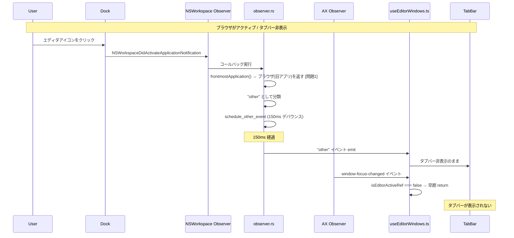
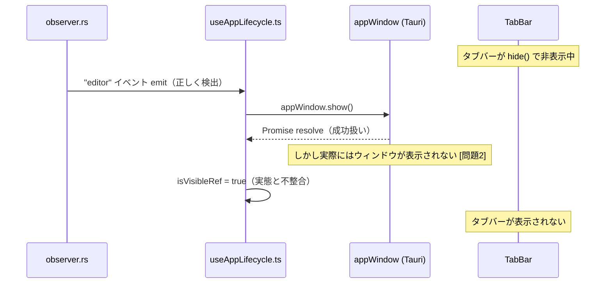
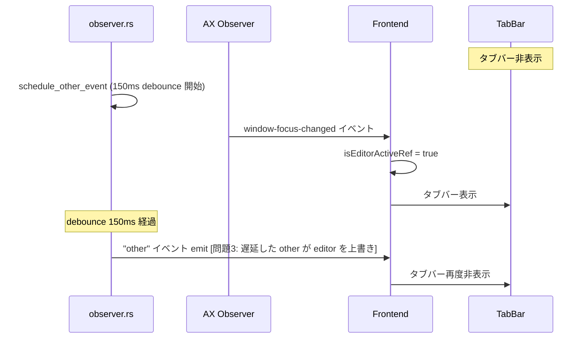
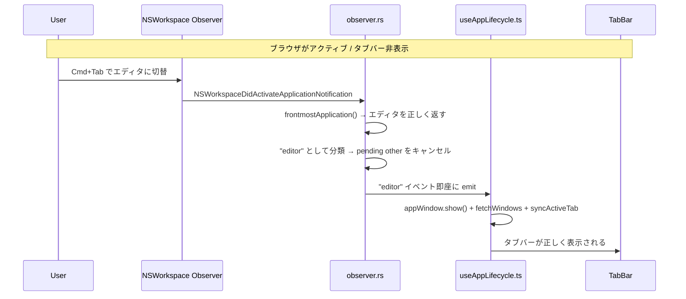
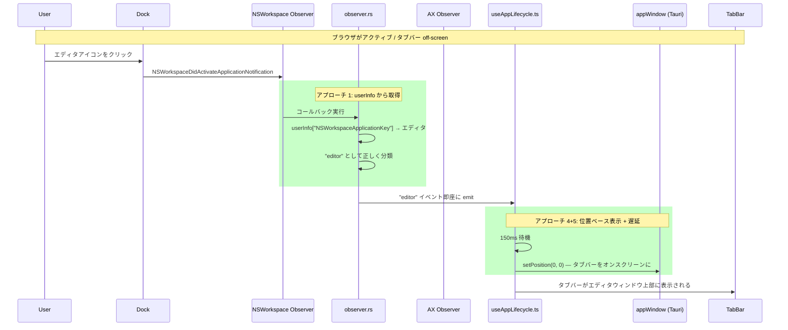
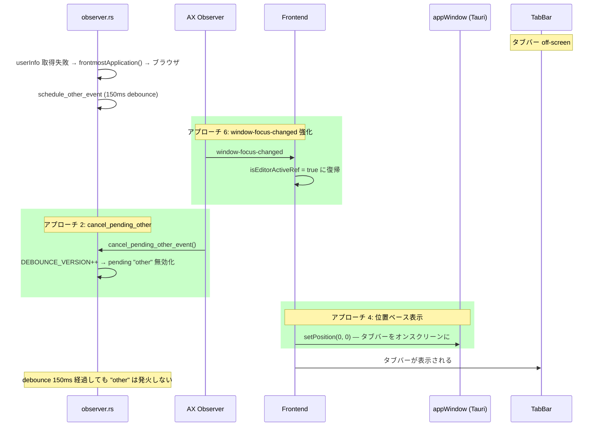
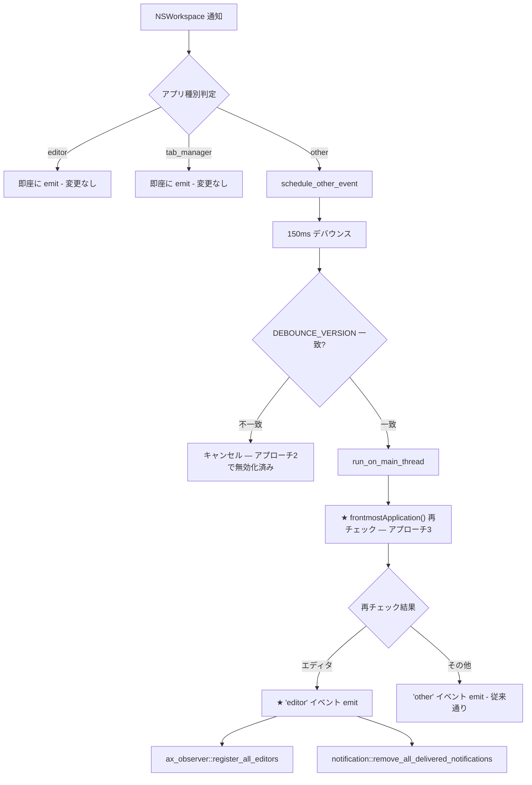
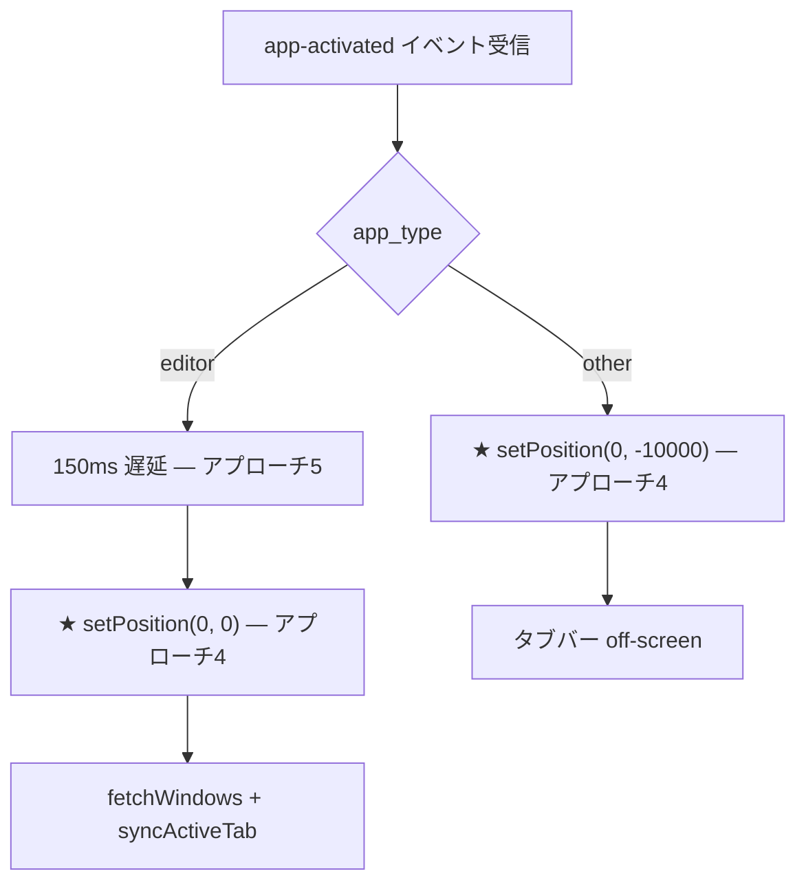
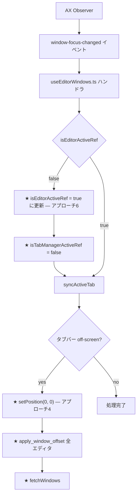

# Dock切替時のタブバー追従修正

## 概要

他のアプリ（ブラウザなど）からDockクリックでエディタに切り替えた際、タブバーがエディタウィンドウに追従せず、ブラウザのウィンドウ上に残ってしまうバグを修正する。

## ユーザーストーリー

エディタユーザーとして、ブラウザなどの非エディタアプリからDockクリックでエディタに戻った際に、タブバーが正しくエディタウィンドウ上に表示されてほしい。

## 受入条件

1. ブラウザからDockクリックでエディタに切り替えた際、タブバーがエディタウィンドウ上部に正しく表示される
2. Cmd+Tab での切り替えが引き続き正常に動作する
3. タブバー内のタブクリックでの切り替えが引き続き正常に動作する
4. Mission Control / Expose / スリープ復帰後のタブバー表示が引き続き正常に動作する
5. 他アプリ切替時のタブバー非表示が引き続き正常に動作する

## スコープ

### やること

- `observer.rs` の通知コールバックで `userInfo` から直接 `NSRunningApplication` を取得
- `observer.rs` の `schedule_other_event` での `frontmostApplication()` 再検証
- `observer.rs` / `ax_observer.rs` で AX Observer 確定時に pending "other" イベントをキャンセル
- `useAppLifecycle.ts` の表示制御を `hide()`/`show()` から位置ベース（`setPosition`）に変更
- `useEditorWindows.ts` の `window-focus-changed` ハンドラのフォールバック改善
- エディタ復帰時の 150ms 遅延による視覚品質の向上

### やらないこと

- ポーリングベースのフォールバック追加
- マルチモニター対応の改善

## 原因分析

### 根本原因

デバッグの結果、Dock クリック時のタブバー追従失敗には **3つの根本原因** が関与していることが判明した。

#### 問題 1: アプリ検出の不正確さ

`observer.rs` の NSWorkspace 通知コールバックで `frontmostApplication()` を使用してアクティブアプリを取得しているが、Dock 経由のアプリ切替時に `frontmostApplication()` がまだ切替前のアプリを返すことがある。

NSWorkspace 通知の `userInfo` から直接 `NSRunningApplication` を取得すれば正確な値が得られる。元の plan では Hardened Runtime リスクを理由に除外していたが、実際には `userInfo` からの取得は問題なく動作することが確認された。

#### 問題 2: macOS の hide/show 信頼性バグ

`ActivationPolicy::Accessory`（Dock アイコンなし）のアプリで `appWindow.hide()` → `appWindow.show()` を呼ぶと、`show()` が Promise を resolve するが実際にはウィンドウが表示されないケースがある。`setAlwaysOnTop(true)` も `show()` 後にハングする。hide/show サイクルが頻繁に発生すると再現しやすい。

#### 問題 3: イベント間のレース条件

NSWorkspace 通知と AX Observer の `window-focus-changed` が異なるタイミングで発火する。debounced "other" イベントが AX Observer による "editor" 確定後に発火して、タブバーを再度非表示にする可能性がある。

### イベントフロー（バグ発生時 — 問題 1 + 3）



### イベントフロー（バグ発生時 — 問題 2）



### イベントフロー（バグ発生時 — 問題 3 レース条件）



### イベントフロー（正常時: Cmd+Tab）



## アプローチ

デバッグで判明した 3 つの問題に対し、以下の 6 つのアプローチで対処する。

| # | アプローチ | 対象問題 | 必要度 |
|---|-----------|---------|--------|
| 1 | `get_activated_app()`: notification の userInfo から NSRunningApplication を取得 | 問題1 | 推奨 |
| 2 | `cancel_pending_other_event()`: AX Observer で editor 確定時に pending "other" をキャンセル | 問題3 | 必須 |
| 3 | `schedule_other_event` 再チェック: debounce 後に `frontmostApplication()` を再確認 | 問題1 | 推奨 |
| 4 | 位置ベース表示制御: `hide()`/`show()` → `setPosition(off-screen)`/`setPosition(0,0)` | 問題2 | 必須 |
| 5 | 150ms 遅延: エディタ復帰時に macOS の画面切替完了を待つ | 視覚品質 | 推奨 |
| 6 | `window-focus-changed` ハンドラ強化: AX Observer 経由の即座復帰 | 問題2,3 | 必須 |

### アプローチ 1: `get_activated_app()` — userInfo から直接取得

NSWorkspace 通知の `userInfo` には `NSWorkspaceApplicationKey` としてアクティブ化されたアプリの `NSRunningApplication` が含まれている。`frontmostApplication()` の代わりにこれを使用することで、Dock クリック時にも正確なアプリを即座に取得できる。

### アプローチ 2: `cancel_pending_other_event()` — pending "other" のキャンセル

AX Observer の `window-focus-changed` が発火した時点でエディタがアクティブであることは確定している。この時点で pending 中の "other" debounce をキャンセルすることで、レース条件によるタブバーの再非表示を防ぐ。`DEBOUNCE_VERSION` をインクリメントすることで実現する。

### アプローチ 3: `schedule_other_event` 再チェック

150ms debounce 後の `run_on_main_thread` 内で `frontmostApplication()` を再チェックし、エディタがアクティブであれば "editor" イベントを emit する。アプローチ 1 が正確に動作する場合でも、フォールバックとして価値がある。

### アプローチ 4: 位置ベース表示制御

`appWindow.hide()` / `appWindow.show()` の代わりに `appWindow.setPosition(PhysicalPosition(0, -10000))` でオフスクリーンに移動し、`appWindow.setPosition(PhysicalPosition(0, 0))` で元に戻す。これにより macOS の `ActivationPolicy::Accessory` アプリにおける hide/show の信頼性バグを回避する。

### アプローチ 5: 150ms 遅延

エディタ復帰時に `setPosition` でタブバーを表示する前に 150ms 待つことで、macOS の画面切替アニメーションが完了してからタブバーが表示され、視覚的なちらつきを防ぐ。

### アプローチ 6: `window-focus-changed` ハンドラ強化

AX Observer はエディタプロセスのみを監視しているため、`window-focus-changed` イベントの発火はエディタのアクティブ化を意味する。`isEditorActiveRef` が false であっても、このイベントを受けた時点でエディタアクティブ状態に復帰させ、タブバーを表示する。observer.rs 側の検出が失敗した場合のフォールバックとして機能する。

## イベントフロー（修正後）

### Dock クリック — 修正後の正常フロー



### Dock クリック — フォールバックフロー（userInfo 取得失敗時）



### Fix: schedule_other_event 再チェックフロー



### Fix: 位置ベース表示制御フロー



### Fix: window-focus-changed フォールバックフロー



## 変更ファイル

| ファイル | アプローチ | 変更内容 | リスク |
|---------|-----------|---------|--------|
| `src-tauri/src/observer.rs` | 1, 2, 3 | `get_activated_app()` で userInfo から取得、`cancel_pending_other_event()` の公開、`schedule_other_event` 再チェック | 低: 正常フローでは動作変化なし |
| `src-tauri/src/ax_observer.rs` | 2 | AX Observer コールバックから `cancel_pending_other_event()` を呼び出し | 低: editor 確定時のキャンセルのみ |
| `src/hooks/useAppLifecycle.ts` | 4, 5 | `hide()`/`show()` を `setPosition` に置換、150ms 遅延の追加 | 中: 表示制御の根本的変更 |
| `src/hooks/useEditorWindows.ts` | 4, 6 | `window-focus-changed` ハンドラ強化、位置ベース表示、`isTabManagerActiveRef` パラメータ追加 | 低: AX Observer はエディタのみ監視 |
| `src/App.tsx` | 6 | `useEditorWindows` に `isTabManagerActiveRef` を渡す | 低: 既存 ref の追加渡しのみ |

## 実装タスク

### タスク 1: observer.rs — userInfo からのアプリ取得 + cancel_pending_other_event

- **ファイル**: `src-tauri/src/observer.rs`
- **内容**:
  - `get_activated_app()`: 通知の `userInfo` から `NSRunningApplication` を取得する関数を追加
  - `cancel_pending_other_event()`: `DEBOUNCE_VERSION` をインクリメントして pending "other" をキャンセルする公開関数を追加
  - `schedule_other_event`: debounce 後の `frontmostApplication()` 再チェック
- **対応アプローチ**: 1, 2, 3
- **依存**: なし
- **見積**: 中

### タスク 2: ax_observer.rs — cancel_pending_other_event 呼び出し

- **ファイル**: `src-tauri/src/ax_observer.rs`
- **内容**: AX Observer のウィンドウフォーカスコールバックから `observer::cancel_pending_other_event()` を呼び出す
- **対応アプローチ**: 2
- **依存**: タスク 1
- **見積**: 極小

### タスク 3: useAppLifecycle.ts — 位置ベース表示制御 + 遅延

- **ファイル**: `src/hooks/useAppLifecycle.ts`
- **内容**:
  - `appWindow.hide()` を `appWindow.setPosition(new PhysicalPosition(0, -10000))` に変更
  - `appWindow.show()` を `appWindow.setPosition(new PhysicalPosition(0, 0))` に変更
  - エディタ復帰時の 150ms 遅延を追加
- **対応アプローチ**: 4, 5
- **依存**: なし
- **見積**: 小

### タスク 4: useEditorWindows.ts — window-focus-changed ハンドラ強化

- **ファイル**: `src/hooks/useEditorWindows.ts`
- **内容**:
  - `isEditorActiveRef` ガードの緩和、フォールバック処理の追加
  - 位置ベース表示制御（`setPosition`）の適用
  - `isTabManagerActiveRef` パラメータの追加
- **対応アプローチ**: 4, 6
- **依存**: なし
- **見積**: 小

### タスク 5: App.tsx — パラメータ追加

- **ファイル**: `src/App.tsx`
- **内容**: `useEditorWindows` 呼び出しに `isTabManagerActiveRef` を追加
- **対応アプローチ**: 6
- **依存**: タスク 4
- **見積**: 極小

### タスク 6: 動作確認

- **内容**: 受入条件に基づく手動テスト
- **依存**: タスク 1-5
- **見積**: 中

## テスト方針

### 手動テスト（必須）

| # | シナリオ | 期待結果 |
|---|---------|---------|
| 1 | ブラウザ → Dock クリックでエディタ切替 | タブバーがエディタウィンドウ上部に表示される |
| 2 | ブラウザ → Cmd+Tab でエディタ切替 | タブバーが表示される（リグレッションなし） |
| 3 | タブバー内のタブクリック | 正常にエディタウィンドウが切り替わる |
| 4 | エディタ → ブラウザ切替 | タブバーが非表示になる |
| 5 | Mission Control / Expose 使用後 | タブバーが正常に表示される |
| 6 | スリープ/ウェイク後 | タブバーが正常に表示される |
| 7 | 複数エディタ間での Dock 切替（VSCode, Cursor 等） | 各エディタで正常動作 |
| 8 | 高速な Dock 連打（エディタ↔ブラウザ交互クリック） | hide/show サイクルが安定して動作する |

### ビルド確認

```bash
cargo check --manifest-path src-tauri/Cargo.toml
cargo clippy --manifest-path src-tauri/Cargo.toml
pnpm build
```
