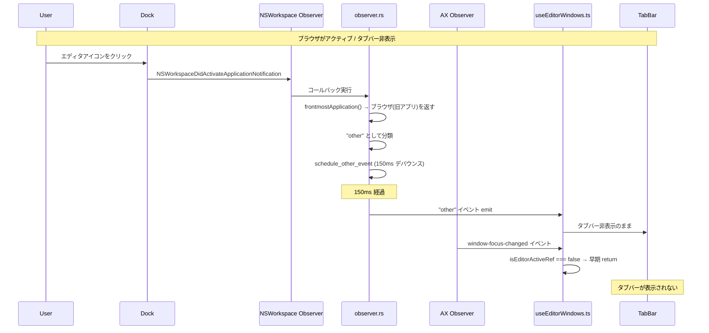
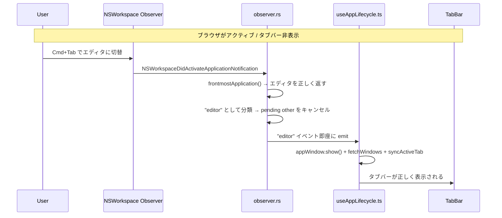
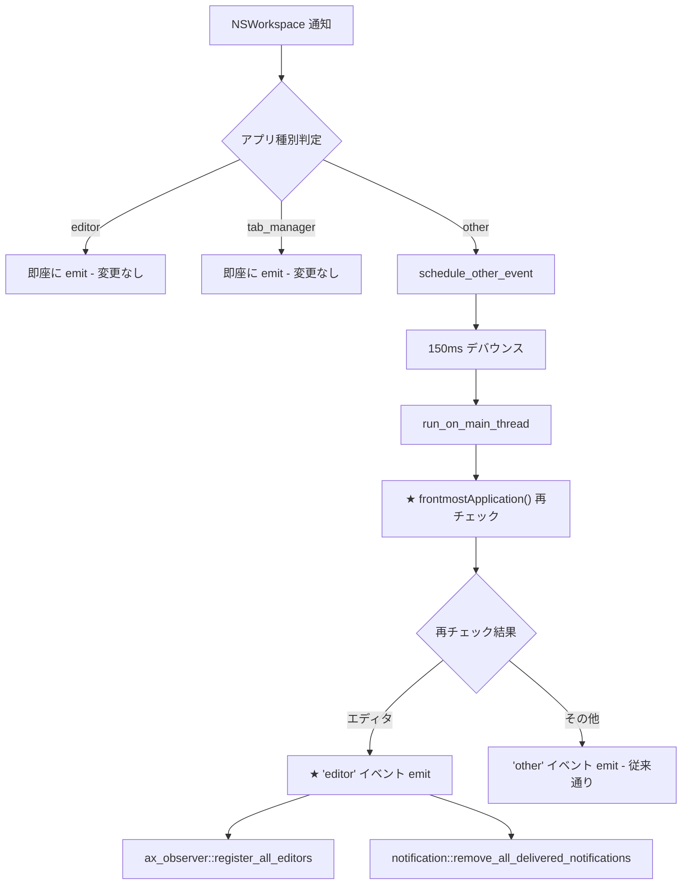
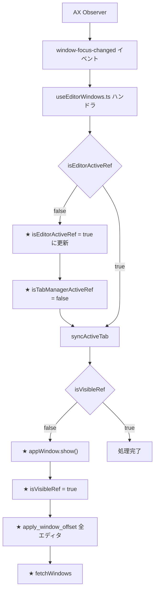

# Dock切替時のタブバー追従修正

## 概要

他のアプリ（ブラウザなど）からDockクリックでエディタに切り替えた際、タブバーがエディタウィンドウに追従せず、ブラウザのウィンドウ上に残ってしまうバグを修正する。

## ユーザーストーリー

エディタユーザーとして、ブラウザなどの非エディタアプリからDockクリックでエディタに戻った際に、タブバーが正しくエディタウィンドウ上に表示されてほしい。

## 受入条件

1. ブラウザからDockクリックでエディタに切り替えた際、タブバーがエディタウィンドウ上部に正しく表示される
2. Cmd+Tab での切り替えが引き続き正常に動作する
3. タブバー内のタブクリックでの切り替えが引き続き正常に動作する
4. Mission Control / Expose / スリープ復帰後のタブバー表示が引き続き正常に動作する
5. 他アプリ切替時のタブバー非表示が引き続き正常に動作する

## スコープ

### やること

- `observer.rs` の `schedule_other_event` での `frontmostApplication()` 再検証
- `useEditorWindows.ts` の `window-focus-changed` ハンドラのフォールバック改善

### やらないこと

- notification `userInfo` の直接パース（Hardened Runtime との互換性リスクを避ける）
- ポーリングベースのフォールバック追加
- マルチモニター対応の改善

## 原因分析

### 根本原因

`observer.rs` の NSWorkspace 通知コールバック（L107-143）で `frontmostApplication()` を使用してアクティブアプリを取得しているが、Dock 経由のアプリ切替時に `frontmostApplication()` の返り値が更新されていない可能性がある。

通知の `userInfo` から直接取得する代わりに `frontmostApplication()` を使用する理由は Hardened Runtime 互換性のためだが（L108 コメント参照）、Dock クリックではタイミングの問題が発生する。

### イベントフロー（バグ発生時）



### イベントフロー（正常時: Cmd+Tab）



## データフロー（修正後）

### Fix 1: schedule_other_event 再検証フロー



### Fix 2: window-focus-changed フォールバックフロー



## バックエンド変更

### observer.rs

#### 変更箇所 1: schedule_other_event 関数

**ファイル**: `src-tauri/src/observer.rs` L64-87

150ms デバウンス後の `run_on_main_thread` 内で `frontmostApplication()` を再チェックし、エディタがアクティブであれば "editor" イベントを emit する。

**変更前**:

```rust
fn schedule_other_event(bundle_id: Option<String>, app_handle: Arc<AppHandle>) {
    let version = DEBOUNCE_VERSION.fetch_add(1, Ordering::SeqCst) + 1;

    let app_handle_for_thread = Arc::clone(&app_handle);
    thread::spawn(move || {
        thread::sleep(Duration::from_millis(DEBOUNCE_DELAY_MS));

        if DEBOUNCE_VERSION.load(Ordering::SeqCst) != version {
            return;
        }

        let app_handle_main = Arc::clone(&app_handle_for_thread);
        let _ = app_handle_for_thread.run_on_main_thread(move || {
            let payload = AppActivationPayload {
                app_type: "other".to_string(),
                bundle_id,
                is_on_primary_screen: is_focused_on_primary_screen(),
            };
            if let Some(window) = app_handle_main.get_webview_window("main") {
                let _ = window.emit("app-activated", payload);
            }
        });
    });
}
```

**変更後**:

```rust
fn schedule_other_event(bundle_id: Option<String>, app_handle: Arc<AppHandle>) {
    let version = DEBOUNCE_VERSION.fetch_add(1, Ordering::SeqCst) + 1;

    let app_handle_for_thread = Arc::clone(&app_handle);
    thread::spawn(move || {
        thread::sleep(Duration::from_millis(DEBOUNCE_DELAY_MS));

        if DEBOUNCE_VERSION.load(Ordering::SeqCst) != version {
            return;
        }

        let app_handle_main = Arc::clone(&app_handle_for_thread);
        let _ = app_handle_for_thread.run_on_main_thread(move || {
            // Re-verify frontmostApplication() after debounce delay.
            // During Dock-initiated app switches, the initial callback may see
            // stale data; by the time the debounce expires the correct app is active.
            let workspace = NSWorkspace::sharedWorkspace();
            if let Some(app) = workspace.frontmostApplication() {
                if is_target_app(&app) {
                    // Editor became active during debounce — emit editor event instead
                    notification::remove_all_delivered_notifications();
                    ax_observer::register_all_editors();
                    let payload = AppActivationPayload {
                        app_type: "editor".to_string(),
                        bundle_id: app.bundleIdentifier().map(|s| s.to_string()),
                        is_on_primary_screen: true,
                    };
                    if let Some(window) = app_handle_main.get_webview_window("main") {
                        let _ = window.emit("app-activated", payload);
                    }
                    return;
                }
            }

            let payload = AppActivationPayload {
                app_type: "other".to_string(),
                bundle_id,
                is_on_primary_screen: is_focused_on_primary_screen(),
            };
            if let Some(window) = app_handle_main.get_webview_window("main") {
                let _ = window.emit("app-activated", payload);
            }
        });
    });
}
```

**変更理由**: Dock クリック時、NSWorkspace 通知コールバック内の `frontmostApplication()` が旧アプリを返す場合がある。150ms デバウンス後に再チェックすることで、実際にアクティブなアプリを正しく検出できる。

## フロントエンド変更

### useEditorWindows.ts

#### 変更箇所 1: UseEditorWindowsParams に isTabManagerActiveRef を追加

**ファイル**: `src/hooks/useEditorWindows.ts` L18-26

```typescript
interface UseEditorWindowsParams {
  dismissWaitingForWindow: (window: EditorWindow) => void;
  syncWaitingTimer: () => void;
  addToHistory: (windows: EditorWindow[]) => void;
  currentBundleIdRef: MutableRefObject<string | null>;
  isEditorActiveRef: MutableRefObject<boolean>;
  isTabManagerActiveRef: MutableRefObject<boolean>;  // 追加
  isVisibleRef: MutableRefObject<boolean>;
  t: TFunction;
}
```

#### 変更箇所 2: フック引数の分割代入に isTabManagerActiveRef を追加

**ファイル**: `src/hooks/useEditorWindows.ts` L47-55

```typescript
export function useEditorWindows({
  dismissWaitingForWindow,
  syncWaitingTimer,
  addToHistory,
  currentBundleIdRef,
  isEditorActiveRef,
  isTabManagerActiveRef,  // 追加
  isVisibleRef,
  t,
}: UseEditorWindowsParams): UseEditorWindowsReturn {
```

#### 変更箇所 3: window-focus-changed イベントハンドラ

**ファイル**: `src/hooks/useEditorWindows.ts` L367-375

AX Observer はエディタプロセスのみを監視しているため、`window-focus-changed` イベントが発火した時点でエディタがアクティブであることは確定している。`isEditorActiveRef` のガードを緩和し、false の場合はエディタアクティブ状態に復帰させる。

**変更前**:

```typescript
const unlistenWindowFocus = await listen("window-focus-changed", async () => {
    if (!isMounted || !isEditorActiveRef.current) return;
    syncActiveTabRef.current();
    if (!isVisibleRef.current) {
        const appWindow = getCurrentWindow();
        await appWindow.show();
    }
});
```

**変更後**:

```typescript
const unlistenWindowFocus = await listen("window-focus-changed", async () => {
    if (!isMounted) return;

    // window-focus-changed is emitted by AX Observer which only monitors
    // editor processes. If this fires, an editor must be active.
    if (!isEditorActiveRef.current) {
        isEditorActiveRef.current = true;
        isTabManagerActiveRef.current = false;
    }

    syncActiveTabRef.current();

    if (!isVisibleRef.current) {
        const appWindow = getCurrentWindow();
        await appWindow.show();
        isVisibleRef.current = true;
        // Apply window offset for all editors
        for (const bid of ALL_EDITOR_BUNDLE_IDS) {
            invoke("apply_window_offset", { bundle_id: bid, offset_y: TAB_BAR_HEIGHT }).catch(() => {});
        }
        await fetchWindowsRef.current();
    }
});
```

**追加 import**: `ALL_EDITOR_BUNDLE_IDS` を `../types/editor` からインポート（`TAB_BAR_HEIGHT` は既にインポート済み）

**useEffect 依存配列の変更** (`L390`):
```typescript
// 変更前
}, [syncWaitingTimer, isEditorActiveRef, isVisibleRef]);

// 変更後
}, [syncWaitingTimer, isEditorActiveRef, isTabManagerActiveRef, isVisibleRef]);
```

**変更理由**: observer.rs が Dock クリック時のエディタアクティベーションを検出できなかった場合のフォールバック。AX Observer はエディタのみを監視しているため、このイベントの発火はエディタのアクティブ化を意味する。

### App.tsx

#### 変更箇所: useEditorWindows に isTabManagerActiveRef を渡す

**ファイル**: `src/App.tsx` L46-54

**変更前**:

```typescript
const editorWindows = useEditorWindows({
    dismissWaitingForWindow: claude.dismissWaitingForWindow,
    syncWaitingTimer: claude.syncWaitingTimer,
    addToHistory: history.addToHistory,
    currentBundleIdRef,
    isEditorActiveRef,
    isVisibleRef,
    t,
});
```

**変更後**:

```typescript
const editorWindows = useEditorWindows({
    dismissWaitingForWindow: claude.dismissWaitingForWindow,
    syncWaitingTimer: claude.syncWaitingTimer,
    addToHistory: history.addToHistory,
    currentBundleIdRef,
    isEditorActiveRef,
    isTabManagerActiveRef,
    isVisibleRef,
    t,
});
```

## 影響範囲

| ファイル | 変更内容 | リスク |
|---------|---------|--------|
| `src-tauri/src/observer.rs` | `schedule_other_event` に `frontmostApplication()` 再検証を追加 | 低: 正常フローでは再チェック結果が同一のため動作変化なし |
| `src/hooks/useEditorWindows.ts` | `window-focus-changed` ハンドラの `isEditorActiveRef` ガード緩和 + パラメータ追加 | 低: AX Observer はエディタプロセスのみ監視しているため誤発火なし |
| `src/App.tsx` | `useEditorWindows` に `isTabManagerActiveRef` を渡す | 低: 既存の ref を追加で渡すのみ |

## 実装タスク

### タスク 1: observer.rs schedule_other_event の修正

- **ファイル**: `src-tauri/src/observer.rs`
- **内容**: `schedule_other_event` 内の `run_on_main_thread` コールバックで `frontmostApplication()` を再チェックし、エディタであれば "editor" イベントを emit
- **依存**: なし
- **見積**: 小

### タスク 2: useEditorWindows.ts window-focus-changed ハンドラの修正

- **ファイル**: `src/hooks/useEditorWindows.ts`
- **内容**: `isEditorActiveRef` ガードの緩和、フォールバック処理（show + apply_window_offset + fetchWindows）の追加、`isTabManagerActiveRef` パラメータの追加、`ALL_EDITOR_BUNDLE_IDS` を `../types/editor` のインポートに追加、`useEffect` 依存配列に `isTabManagerActiveRef` を追加
- **依存**: なし
- **見積**: 小

### タスク 3: App.tsx パラメータ追加

- **ファイル**: `src/App.tsx`
- **内容**: `useEditorWindows` 呼び出しに `isTabManagerActiveRef` を追加
- **依存**: タスク 2
- **見積**: 極小

### タスク 4: 動作確認

- **内容**: 受入条件に基づく手動テスト
- **依存**: タスク 1, 2, 3
- **見積**: 中

## テスト方針

### 手動テスト（必須）

| # | シナリオ | 期待結果 |
|---|---------|---------|
| 1 | ブラウザ → Dock クリックでエディタ切替 | タブバーがエディタウィンドウ上部に表示される |
| 2 | ブラウザ → Cmd+Tab でエディタ切替 | タブバーが表示される（リグレッションなし） |
| 3 | タブバー内のタブクリック | 正常にエディタウィンドウが切り替わる |
| 4 | エディタ → ブラウザ切替 | タブバーが非表示になる |
| 5 | Mission Control / Expose 使用後 | タブバーが正常に表示される |
| 6 | スリープ/ウェイク後 | タブバーが正常に表示される |
| 7 | 複数エディタ間での Dock 切替（VSCode, Cursor 等） | 各エディタで正常動作 |

### ビルド確認

```bash
cargo check --manifest-path src-tauri/Cargo.toml
cargo clippy --manifest-path src-tauri/Cargo.toml
pnpm build
```
