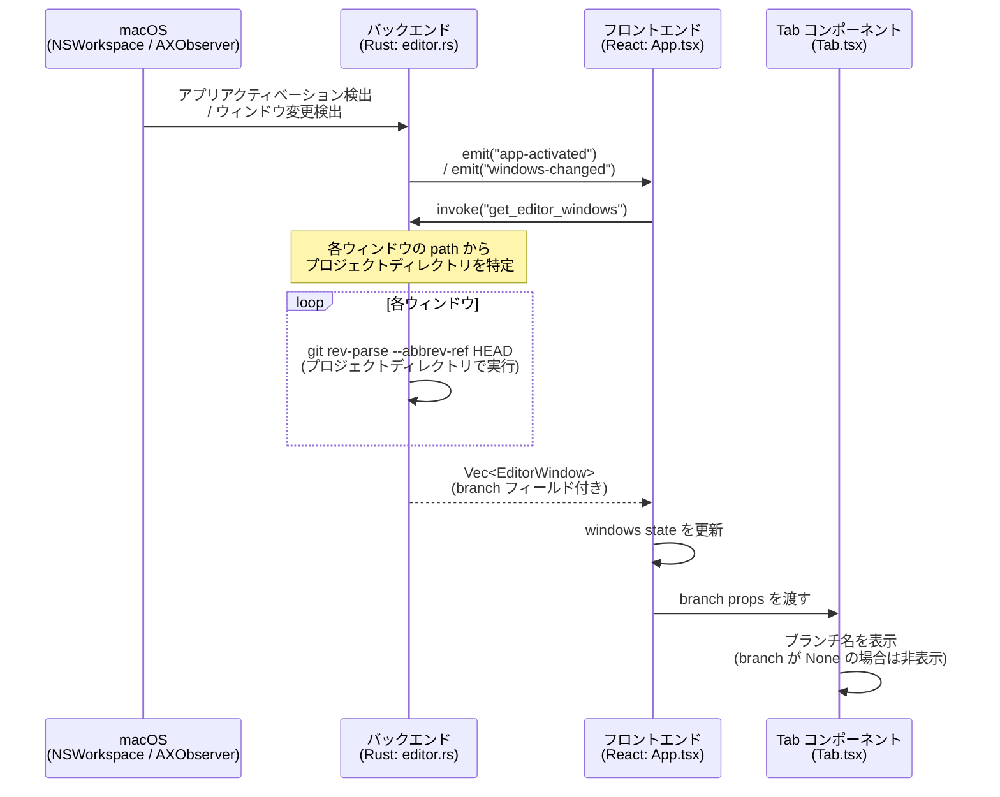

# Gitブランチ表示

> 各タブ内にプロジェクトの現在のGitブランチ名を表示し、複数ウィンドウ間のブランチ状況を一目で把握できる機能

## ステータス

Draft

## 背景・課題

Editor Tab Managerで複数のエディタウィンドウを管理する際、各ウィンドウがどのGitブランチで作業しているかを確認するには、個別にウィンドウを切り替えてエディタのステータスバーを見る必要がある。
タブバー上でブランチ名が確認できないため、誤ったブランチで作業を続けてしまうリスクがある。

## ユーザーストーリー

- As a Editor Tab Managerのユーザー, I want 各タブ内にそのプロジェクトの現在のGitブランチ名を表示して欲しい, so that 複数のエディタウィンドウを切り替えながら作業する際、どのブランチで作業しているかを一目で確認できる

## 受入条件

- [ ] 各タブ内にGitブランチ名が表示される
- [ ] ブランチ名はプロジェクト名の近くに表示される
- [ ] Gitリポジトリでないプロジェクトではブランチ名が非表示になる
- [ ] ブランチが切り替わった場合、次のウィンドウ操作（タブ切り替え等）で表示が更新される

## スコープ

### 対象

- タブ内へのGitブランチ名表示

### 対象外

- 特になし（初期スコープは最小限）

## データフロー

### メインフロー: ブランチ名の取得と表示

既存のウィンドウ情報取得フローを拡張し、ブランチ名を同時に取得する。



### 型の変更

**Rust (editor.rs)**:
```rust
// EditorWindow に branch フィールドを追加
pub struct EditorWindow {
    pub id: u32,
    pub name: String,
    pub path: String,
    pub branch: Option<String>,  // 新規追加
}
```

**TypeScript (App.tsx)**:
```typescript
// EditorWindow に branch フィールドを追加
interface EditorWindow {
  id: number;
  name: string;
  path: string;
  branch?: string;  // 新規追加
}
```

### 更新タイミング

| トリガー | イベント | 結果 |
|---------|--------|------|
| エディタがアクティブになった | `app-activated` | ウィンドウ一覧 + ブランチ名を再取得 |
| ウィンドウが作成/破棄/タイトル変更された | `windows-changed` | ウィンドウ一覧 + ブランチ名を再取得 |
| フォーカスウィンドウが変わった | `window-focus-changed` | アクティブインデックスのみ更新（ブランチ再取得なし） |

### 備考

- 新しいイベントやポーリング処理は不要（既存フローへの拡張のみ）
- Gitリポジトリでないプロジェクトでは `branch: None` となり、UIでは非表示
- `git` コマンドが利用できない環境では全ウィンドウで `branch: None`

## 設計ドキュメント

| ドキュメント | 内容 | ステータス |
|-------------|------|-----------|
| [frontend-spec.md](./frontend-spec.md) | フロントエンド設計（Tab コンポーネントへのブランチ名表示 + バックエンド変更） | 完了 |
| api-spec.md | API設計 | 該当なし（既存コマンドの拡張のみ） |
| db-spec.md | DB設計 | 該当なし（DB変更なし） |
| [implementation-plan.md](./implementation-plan.md) | 実装タスク、影響範囲、テスト方針 | 完了 |

## 生成情報

- 生成日: 2026-02-17
- 対象プロジェクト: vscode-tab-manager (Editor Tab Manager)

## 次のステップ

`/feature-spec:implement` で実装に進む。修正したい箇所がある場合は `/feature-spec:revise` を使用。
