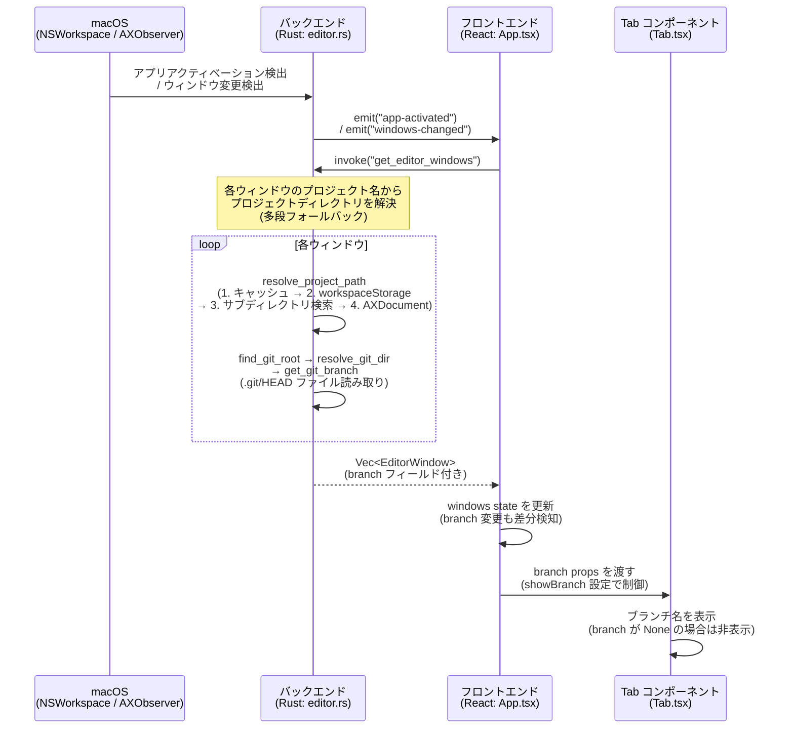
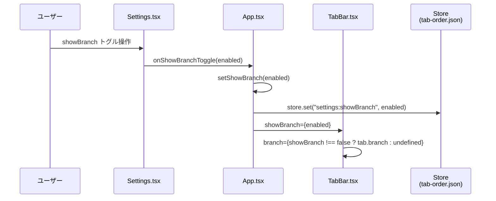

# Gitブランチ表示

> 各タブ内にプロジェクトの現在のGitブランチ名を表示し、複数ウィンドウ間のブランチ状況を一目で把握できる機能

## ステータス

Draft

## 背景・課題

Editor Tab Managerで複数のエディタウィンドウを管理する際、各ウィンドウがどのGitブランチで作業しているかを確認するには、個別にウィンドウを切り替えてエディタのステータスバーを見る必要がある。
タブバー上でブランチ名が確認できないため、誤ったブランチで作業を続けてしまうリスクがある。

## ユーザーストーリー

- As a Editor Tab Managerのユーザー, I want 各タブ内にそのプロジェクトの現在のGitブランチ名を表示して欲しい, so that 複数のエディタウィンドウを切り替えながら作業する際、どのブランチで作業しているかを一目で確認できる

## 受入条件

- [ ] 各タブ内にGitブランチ名が表示される
- [ ] ブランチ名はプロジェクト名の近くに表示される
- [ ] Gitリポジトリでないプロジェクトではブランチ名が非表示になる
- [ ] ブランチが切り替わった場合、次のウィンドウ操作（タブ切り替え等）で表示が更新される
- [ ] 設定画面からブランチ表示のON/OFFを切り替えられる（デフォルト: ON）

## スコープ

### 対象

- タブ内へのGitブランチ名表示

### 対象外

- 特になし（初期スコープは最小限）

## データフロー

### メインフロー: ブランチ名の取得と表示

既存のウィンドウ情報取得フローを拡張し、ブランチ名を同時に取得する。



### 設定フロー: ブランチ表示のON/OFF



### 型の変更

**Rust (editor.rs)**:
```rust
// EditorWindow に branch フィールドを追加
pub struct EditorWindow {
    pub id: u32,
    pub name: String,
    pub path: String,
    pub branch: Option<String>,  // 新規追加
}
```

**TypeScript (App.tsx)**:
```typescript
// EditorWindow に branch フィールドを追加
interface EditorWindow {
  id: number;
  name: string;
  path: string;
  branch?: string;  // 新規追加
}
```

### プロジェクトパス解決（多段フォールバック）

ブランチ名取得にはプロジェクトのフルパスが必要。ウィンドウタイトルからはプロジェクト名のみ取得できるため、以下の多段フォールバックでフルパスを解決する:

1. **キャッシュ**: `PROJECT_PATH_CACHE`（プロジェクト名→PathBuf の HashMap）から検索
2. **workspaceStorage**: エディタの `~/Library/Application Support/{Editor}/User/workspaceStorage/*/workspace.json` から一括読み込み → キャッシュに格納
3. **サブディレクトリ検索**: キャッシュ済みパスの子ディレクトリにプロジェクト名と一致する `.git` 付きディレクトリがないか検索
4. **AXDocument フォールバック**: Accessibility API でウィンドウの開いているドキュメントパスを取得 → `find_git_root` で git root を特定

### サブモジュール対応

`.git` がディレクトリではなくファイルの場合（git サブモジュール）、`gitdir: <path>` の参照先を解決して `.git/HEAD` を読み取る。

### 更新タイミング

| トリガー | イベント | 結果 |
|---------|--------|------|
| エディタがアクティブになった | `app-activated` | ウィンドウ一覧 + ブランチ名を再取得 |
| ウィンドウが作成/破棄/タイトル変更された | `windows-changed` | ウィンドウ一覧 + ブランチ名を再取得 |
| フォーカスウィンドウが変わった | `window-focus-changed` | アクティブインデックスのみ更新（ブランチ再取得なし） |

### 備考

- 新しいイベントやポーリング処理は不要（既存フローへの拡張のみ）
- Gitリポジトリでないプロジェクトでは `branch: None` となり、UIでは非表示
- `git` コマンドには依存しない（`.git/HEAD` ファイルの直接読み取りで高速に動作）
- フロントエンドの `refreshWindows` / `fetchWindows` で `branch` の変更も差分検知対象に含む
- ブランチ表示は設定画面からON/OFF切替可能（Store キー: `settings:showBranch`、デフォルト: ON）

## 設計ドキュメント

| ドキュメント | 内容 | ステータス |
|-------------|------|-----------|
| [frontend-spec.md](./frontend-spec.md) | フロントエンド設計（Tab コンポーネントへのブランチ名表示 + バックエンド変更） | 完了 |
| api-spec.md | API設計 | 該当なし（既存コマンドの拡張のみ） |
| db-spec.md | DB設計 | 該当なし（DB変更なし） |
| [implementation-plan.md](./implementation-plan.md) | 実装タスク、影響範囲、テスト方針 | 完了 |

## 変更履歴

| 日付 | 変更内容 | 変更理由 |
|------|---------|---------|
| 2026-02-17 | 初版作成 | - |
| 2026-02-17 | showBranch設定トグル、多段パス解決、サブモジュール対応、branch変更検知、i18nキー、依存ライブラリを仕様に反映 | verify で検出された仕様外の追加実装6件を仕様に反映 |

## 生成情報

- 生成日: 2026-02-17
- 対象プロジェクト: vscode-tab-manager (Editor Tab Manager)

## 次のステップ

`/feature-spec:implement` で実装に進む。修正したい箇所がある場合は `/feature-spec:revise` を使用。
