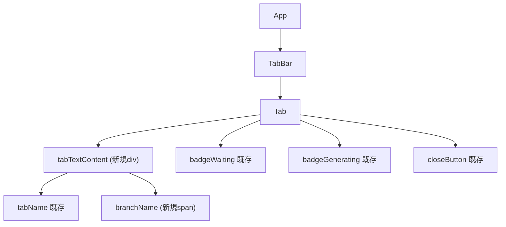

# フロントエンド設計

## コンポーネントツリー



## 新規コンポーネント

新規コンポーネントの追加はなし。既存コンポーネントの変更のみで実現する。

## 既存コンポーネントの変更

### `App.tsx` - EditorWindow 型拡張

**パス**: `src/App.tsx`

**変更箇所**: EditorWindow インターフェース（L21-25付近）

**変更内容**: `branch` フィールドを追加

```typescript
// Before
export interface EditorWindow {
  id: number;
  name: string;
  path: string;
}

// After
export interface EditorWindow {
  id: number;
  name: string;
  path: string;
  branch?: string;  // Git ブランチ名（Gitリポジトリでない場合は undefined）
}
```

その他の変更なし。バックエンドからの返却値に `branch` が含まれるため、`invoke<EditorWindow[]>("get_editor_windows", ...)` で取得した結果に自動的に `branch` が反映される。

**パターン参照**: 「既存の `EditorWindow` 型（`src/App.tsx` L21）に Optional フィールドを追加するパターン」

---

### `Tab.tsx` - ブランチ名表示

**パス**: `src/components/Tab.tsx`

**役割**: タブ内にGitブランチ名を2行目として表示する

**Props変更:**

```typescript
// Before
interface TabProps {
  name: string;
  isActive: boolean;
  isDragging: boolean;
  onClick: (index: number) => void;
  onClose: (index: number) => void;
  onDragStart: (index: number) => void;
  onDragEnd: () => void;
  onDragOver: (index: number) => void;
  onDrop: (index: number) => void;
  index: number;
  claudeStatus?: ClaudeStatus;
  colorId?: string | null;
  onContextMenu?: (index: number) => void;
}

// After
interface TabProps {
  name: string;
  isActive: boolean;
  isDragging: boolean;
  onClick: (index: number) => void;
  onClose: (index: number) => void;
  onDragStart: (index: number) => void;
  onDragEnd: () => void;
  onDragOver: (index: number) => void;
  onDrop: (index: number) => void;
  index: number;
  claudeStatus?: ClaudeStatus;
  colorId?: string | null;
  onContextMenu?: (index: number) => void;
  branch?: string;  // 新規追加: Git ブランチ名
}
```

**状態管理:**

既存のローカル状態のみ使用。新規状態の追加なし。

```typescript
// 既存（変更なし）
const [isHovered, setIsHovered] = useState(false);
```

**レンダリング構造の変更（L89-106付近）:**

```typescript
// Before
<div style={...styles.tab...}>
  <span style={styles.tabName}>{displayName}</span>
  {claudeStatus === "waiting" && <div style={styles.badgeWaiting} />}
  {claudeStatus === "generating" && <div style={styles.badgeGenerating} className="pulse-animation" />}
  <button style={...styles.closeButton...}>x</button>
</div>

// After
<div style={...styles.tab...}>
  <div style={styles.tabTextContent}>
    <span style={styles.tabName}>{displayName}</span>
    {branch && (
      <span style={styles.branchName}>&#x2387; {branch}</span>
    )}
  </div>
  {claudeStatus === "waiting" && <div style={styles.badgeWaiting} />}
  {claudeStatus === "generating" && <div style={styles.badgeGenerating} className="pulse-animation" />}
  <button style={...styles.closeButton...}>x</button>
</div>
```

**新規スタイル（styles オブジェクトに追加）:**

```typescript
tabTextContent: {
  display: "flex",
  flexDirection: "column",
  overflow: "hidden",
  flex: 1,
  minWidth: 0,
} as React.CSSProperties,
branchName: {
  fontSize: "10px",
  color: "rgba(255, 255, 255, 0.5)",
  whiteSpace: "nowrap",
  overflow: "hidden",
  textOverflow: "ellipsis",
  lineHeight: "1.2",
} as React.CSSProperties,
```

**既存スタイルの変更:**

`tabName` スタイルから `flex: 1` を削除する（`tabTextContent` に移動するため）。

```typescript
// Before
tabName: {
  color: "rgba(255, 255, 255, 0.9)",
  fontSize: "12px",
  fontWeight: 500,
  overflow: "hidden",
  textOverflow: "ellipsis",
  whiteSpace: "nowrap",
  flex: 1,
},

// After
tabName: {
  color: "rgba(255, 255, 255, 0.9)",
  fontSize: "12px",
  fontWeight: 500,
  overflow: "hidden",
  textOverflow: "ellipsis",
  whiteSpace: "nowrap",
},
```

**UIワイヤーフレーム:**

```
タブ（ブランチあり）:
┌──────────────────────────────────────────┐
│ ┌─────────────────┐              ● [x]   │  ← 32px高さ
│ │ my-project      │                      │  ← プロジェクト名 12px
│ │ ⎇ feat/login    │                      │  ← ブランチ名 10px 薄色
│ └─────────────────┘                      │
└──────────────────────────────────────────┘
  tabTextContent       badges  closeButton

タブ（ブランチなし / 非Gitリポジトリ）:
┌──────────────────────────────────────────┐
│ ┌─────────────────┐              ● [x]   │  ← 32px高さ
│ │ my-project      │                      │  ← プロジェクト名のみ
│ └─────────────────┘                      │
└──────────────────────────────────────────┘
  tabTextContent       badges  closeButton
```

**パターン参照**: 「既存の `claudeStatus` バッジ（`src/components/Tab.tsx` L91-92）の条件レンダリングパターンに倣う」

---

### `TabBar.tsx` - branch prop の受け渡し

**パス**: `src/components/TabBar.tsx`

**変更箇所**: Tab コンポーネントの props 渡し部分（L88-103付近）

**変更内容**: `branch` prop を追加

```typescript
// Before
<Tab
  key={tab.name}
  name={tab.name}
  isActive={index === activeIndex}
  isDragging={index === draggedIndex}
  onClick={handleTabClick}
  onClose={handleCloseTab}
  onDragStart={handleDragStart}
  onDragEnd={handleDragEnd}
  onDragOver={handleDragOver}
  onDrop={handleDrop}
  index={index}
  claudeStatus={getClaudeStatusForTab(tab.name, claudeStatuses)}
  colorId={tabColors?.[tab.name] ?? null}
  onContextMenu={handleTabContextMenu}
/>

// After
<Tab
  key={tab.name}
  name={tab.name}
  isActive={index === activeIndex}
  isDragging={index === draggedIndex}
  onClick={handleTabClick}
  onClose={handleCloseTab}
  onDragStart={handleDragStart}
  onDragEnd={handleDragEnd}
  onDragOver={handleDragOver}
  onDrop={handleDrop}
  index={index}
  claudeStatus={getClaudeStatusForTab(tab.name, claudeStatuses)}
  colorId={tabColors?.[tab.name] ?? null}
  onContextMenu={handleTabContextMenu}
  branch={tab.branch}
/>
```

TabBarProps インターフェースの変更は不要。既に `tabs: EditorWindow[]` を受け取っており、`EditorWindow` 型に `branch` が追加されるため自動的に反映される。

---

### `editor.rs` - EditorWindow struct + Git ブランチ取得

**パス**: `src-tauri/src/editor.rs`

**変更箇所1**: EditorWindow struct（L5-10付近）

```rust
// Before
#[derive(Debug, Clone, Serialize, Deserialize)]
pub struct EditorWindow {
    pub id: u32,
    pub name: String,
    pub path: String,
}

// After
#[derive(Debug, Clone, Serialize, Deserialize)]
pub struct EditorWindow {
    pub id: u32,
    pub name: String,
    pub path: String,
    pub branch: Option<String>,  // Git ブランチ名
}
```

**変更箇所2**: `get_editor_state_with_config` 関数（L79-83付近）

EditorWindow 生成時に `branch` フィールドを追加。

```rust
// Before
windows.push(EditorWindow {
    id: *window_id,
    name,
    path: title.clone(),
});

// After
let document_path = ax_helper::get_document_path(pid, *window_id);
let branch = document_path
    .and_then(|doc_path| {
        let dir = std::path::Path::new(&doc_path).parent()?;
        find_git_root(dir)
    })
    .and_then(|git_root| get_git_branch(&git_root));

windows.push(EditorWindow {
    id: *window_id,
    name,
    path: title.clone(),
    branch,
});
```

**変更箇所3**: `get_editor_windows_with_config` 関数（L131-136付近）

同様に `branch` フィールドを追加。

```rust
// Before
Some(EditorWindow {
    id: *window_id,
    name,
    path: title.clone(),
})

// After
let document_path = ax_helper::get_document_path(pid, *window_id);
let branch = document_path
    .and_then(|doc_path| {
        let dir = std::path::Path::new(&doc_path).parent()?;
        find_git_root(dir)
    })
    .and_then(|git_root| get_git_branch(&git_root));

Some(EditorWindow {
    id: *window_id,
    name,
    path: title.clone(),
    branch,
})
```

**新規関数**: `find_git_root`

```rust
/// プロジェクトディレクトリから上位に向かって .git ディレクトリを探索し、git root を返す
fn find_git_root(start_path: &std::path::Path) -> Option<std::path::PathBuf> {
    let mut current = start_path;
    loop {
        if current.join(".git").exists() {
            return Some(current.to_path_buf());
        }
        current = current.parent()?;
    }
}
```

**新規関数**: `get_git_branch`

```rust
/// .git/HEAD ファイルを読んでブランチ名を取得する
/// git コマンドに依存せず、ファイル読み取りのみで高速に動作
fn get_git_branch(git_root: &std::path::Path) -> Option<String> {
    let head_path = git_root.join(".git").join("HEAD");
    let content = std::fs::read_to_string(head_path).ok()?;
    let content = content.trim();

    if let Some(ref_path) = content.strip_prefix("ref: refs/heads/") {
        // 通常ブランチ: "ref: refs/heads/main" → "main"
        Some(ref_path.to_string())
    } else if content.len() >= 7 {
        // Detached HEAD: コミットハッシュの先頭7文字
        Some(content[..7].to_string())
    } else {
        None
    }
}
```

---

### `ax_helper.rs` - AXDocument 属性の取得

**パス**: `src-tauri/src/ax_helper.rs`

**変更箇所**: 新規関数の追加

```rust
/// 指定ウィンドウの AXDocument 属性からファイルパスを取得する
/// AXDocument は "file:///path/to/file" 形式の URL 文字列を返す
pub fn get_document_path(pid: i32, target_window_id: u32) -> Option<String> {
    // 1. AXUIElement::application(pid) でアプリ要素を取得
    // 2. windows() で全ウィンドウを取得
    // 3. CGWindowID が一致するウィンドウを探す
    // 4. AXDocument 属性を取得（AXUIElementCopyAttributeValue）
    // 5. "file://" プレフィックスを除去してファイルパスを返す
    // 6. 取得失敗時は None を返す
}
```

**パターン参照**: 「既存の `is_window_minimized_by_id`（`src-tauri/src/ax_helper.rs` L517）の AXUIElementCopyAttributeValue パターンに倣う」

## Hooks

新規 Hook の追加なし。`branch` は `EditorWindow` 型に含まれてバックエンドから返却されるため、既存の `invoke` / `listen` フローで自動的に取得される。

## エッジケース

| ケース | branch の値 | UI表示 |
|--------|------------|--------|
| Gitリポジトリ | `"main"` | &#x2387; main |
| 非Gitリポジトリ | `undefined` | ブランチ行を非表示 |
| detached HEAD | `"a1b2c3d"` | &#x2387; a1b2c3d（短縮ハッシュ7文字） |
| 長いブランチ名 | `"feature/very-long-branch-name-..."` | &#x2387; feature/very-lo... (text-overflow: ellipsis) |
| AXDocument 取得不可 | `undefined` | ブランチ行を非表示 |
| 新規ウィンドウ（ファイル未開） | `undefined` | ブランチ行を非表示 |
| ブランチ名にスラッシュ含む | `"feature/user/login"` | &#x2387; feature/user/login |
| .git/HEAD 読み取り失敗 | `undefined` | ブランチ行を非表示 |

## ファイル構成

| ファイル | 役割 | 操作 |
|---------|------|------|
| `src/App.tsx` | EditorWindow 型に branch フィールド追加 | 変更 |
| `src/components/Tab.tsx` | branch prop 追加、ブランチ名表示UI、スタイル追加 | 変更 |
| `src/components/TabBar.tsx` | Tab への branch prop 受け渡し | 変更 |
| `src-tauri/src/editor.rs` | EditorWindow に branch 追加、find_git_root / get_git_branch 関数追加 | 変更 |
| `src-tauri/src/ax_helper.rs` | get_document_path 関数追加（AXDocument 属性取得） | 変更 |

## テスト

| テストファイル | テスト内容 | 種別 |
|-------------|---------|------|
| `src-tauri/src/editor.rs` (インラインテスト) | find_git_root: gitリポジトリ内のパスで git root を正しく返す | unit |
| `src-tauri/src/editor.rs` (インラインテスト) | find_git_root: 非gitリポジトリのパスで None を返す | unit |
| `src-tauri/src/editor.rs` (インラインテスト) | get_git_branch: "ref: refs/heads/main" から "main" を取得 | unit |
| `src-tauri/src/editor.rs` (インラインテスト) | get_git_branch: detached HEAD でコミットハッシュ先頭7文字を返す | unit |
| `src-tauri/src/editor.rs` (インラインテスト) | get_git_branch: .git/HEAD がない場合に None を返す | unit |
| (手動テスト) | Tab: branch prop がある場合にブランチ名が表示される | manual |
| (手動テスト) | Tab: branch prop が undefined の場合にブランチ行が非表示 | manual |
| (手動テスト) | Tab: 長いブランチ名が ellipsis で省略される | manual |
