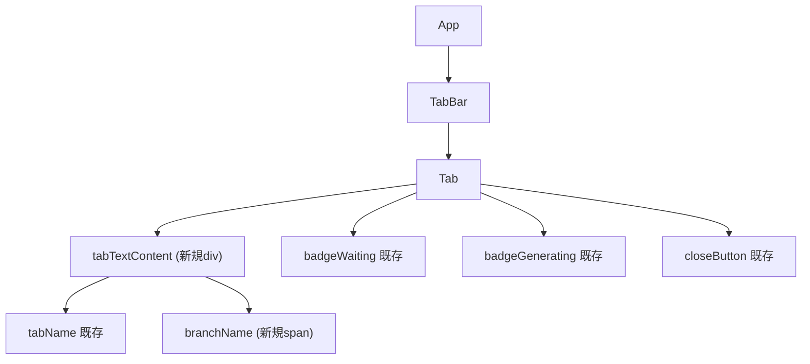

# フロントエンド設計

## コンポーネントツリー



## 新規コンポーネント

新規コンポーネントの追加はなし。既存コンポーネントの変更のみで実現する。

## 既存コンポーネントの変更

### `App.tsx` - EditorWindow 型拡張

**パス**: `src/App.tsx`

**変更箇所**: EditorWindow インターフェース（L21-25付近）

**変更内容**: `branch` フィールドを追加

```typescript
// Before
export interface EditorWindow {
  id: number;
  name: string;
  path: string;
}

// After
export interface EditorWindow {
  id: number;
  name: string;
  path: string;
  branch?: string;  // Git ブランチ名（Gitリポジトリでない場合は undefined）
}
```

その他の変更なし。バックエンドからの返却値に `branch` が含まれるため、`invoke<EditorWindow[]>("get_editor_windows", ...)` で取得した結果に自動的に `branch` が反映される。

**showBranch 設定状態の追加**:

```typescript
const [showBranch, setShowBranch] = useState<boolean>(true);
```

- 初期化時に Store から `settings:showBranch` を読み込み（デフォルト: true）
- `handleShowBranchToggle` で State 更新 + Store 永続化
- TabBar に `showBranch={showBranch}` として渡す
- Settings に `showBranchEnabled={showBranch}` / `onShowBranchToggle={handleShowBranchToggle}` として渡す

**branch 変更検知の追加**:

`refreshWindows` / `fetchWindows` 内のウィンドウ変更検知に `branch` の比較を追加:

```typescript
const hasChanged = sorted.length !== currentWindows.length ||
  sorted.some((w, i) => currentWindows[i]?.name !== w.name || currentWindows[i]?.branch !== w.branch);
```

**パターン参照**: 「既存の `EditorWindow` 型（`src/App.tsx` L21）に Optional フィールドを追加するパターン」

---

### `Settings.tsx` - ブランチ表示設定トグル

**パス**: `src/components/Settings.tsx`

**役割**: 設定画面にGitブランチ表示のON/OFFトグルを追加する

**Props変更:**

```typescript
// 追加されたProps
interface SettingsProps {
  // ...既存Props...
  showBranchEnabled: boolean;      // 新規追加
  onShowBranchToggle: (enabled: boolean) => void;  // 新規追加
}
```

**レンダリング**: 自動起動設定の下、言語設定の上にトグルカードを追加。既存の `switchRow` / `switchTrack` / `switchThumb` スタイルパターンを再利用。

**i18n キー（`ja.json` / `en.json` に追加）:**

| キー | ja | en |
|------|----|----|
| `settings.showBranchLabel` | Gitブランチ名を表示 | Show Git Branch |
| `settings.showBranchDescription` | タブにGitブランチ名を表示します | Display Git branch name on tabs |

---

### `Tab.tsx` - ブランチ名表示

**パス**: `src/components/Tab.tsx`

**役割**: タブ内にGitブランチ名を2行目として表示する

**Props変更:**

```typescript
// Before
interface TabProps {
  name: string;
  isActive: boolean;
  isDragging: boolean;
  onClick: (index: number) => void;
  onClose: (index: number) => void;
  onDragStart: (index: number) => void;
  onDragEnd: () => void;
  onDragOver: (index: number) => void;
  onDrop: (index: number) => void;
  index: number;
  claudeStatus?: ClaudeStatus;
  colorId?: string | null;
  onContextMenu?: (index: number) => void;
}

// After
interface TabProps {
  name: string;
  isActive: boolean;
  isDragging: boolean;
  onClick: (index: number) => void;
  onClose: (index: number) => void;
  onDragStart: (index: number) => void;
  onDragEnd: () => void;
  onDragOver: (index: number) => void;
  onDrop: (index: number) => void;
  index: number;
  claudeStatus?: ClaudeStatus;
  colorId?: string | null;
  onContextMenu?: (index: number) => void;
  branch?: string;  // 新規追加: Git ブランチ名
}
```

**状態管理:**

既存のローカル状態のみ使用。新規状態の追加なし。

```typescript
// 既存（変更なし）
const [isHovered, setIsHovered] = useState(false);
```

**レンダリング構造の変更（L89-106付近）:**

```typescript
// Before
<div style={...styles.tab...}>
  <span style={styles.tabName}>{displayName}</span>
  {claudeStatus === "waiting" && <div style={styles.badgeWaiting} />}
  {claudeStatus === "generating" && <div style={styles.badgeGenerating} className="pulse-animation" />}
  <button style={...styles.closeButton...}>x</button>
</div>

// After
<div style={...styles.tab...}>
  <div style={styles.tabTextContent}>
    <span style={styles.tabName}>{displayName}</span>
    {branch && (
      <span style={styles.branchName}>&#x2387; {branch}</span>
    )}
  </div>
  {claudeStatus === "waiting" && <div style={styles.badgeWaiting} />}
  {claudeStatus === "generating" && <div style={styles.badgeGenerating} className="pulse-animation" />}
  <button style={...styles.closeButton...}>x</button>
</div>
```

**新規スタイル（styles オブジェクトに追加）:**

```typescript
tabTextContent: {
  display: "flex",
  flexDirection: "column",
  overflow: "hidden",
  flex: 1,
  minWidth: 0,
} as React.CSSProperties,
branchName: {
  fontSize: "10px",
  color: "rgba(255, 255, 255, 0.5)",
  whiteSpace: "nowrap",
  overflow: "hidden",
  textOverflow: "ellipsis",
  lineHeight: "1.2",
} as React.CSSProperties,
```

**既存スタイルの変更:**

`tabName` スタイルから `flex: 1` を削除する（`tabTextContent` に移動するため）。

```typescript
// Before
tabName: {
  color: "rgba(255, 255, 255, 0.9)",
  fontSize: "12px",
  fontWeight: 500,
  overflow: "hidden",
  textOverflow: "ellipsis",
  whiteSpace: "nowrap",
  flex: 1,
},

// After
tabName: {
  color: "rgba(255, 255, 255, 0.9)",
  fontSize: "12px",
  fontWeight: 500,
  overflow: "hidden",
  textOverflow: "ellipsis",
  whiteSpace: "nowrap",
},
```

**UIワイヤーフレーム:**

```
タブ（ブランチあり）:
┌──────────────────────────────────────────┐
│ ┌─────────────────┐              ● [x]   │  ← 32px高さ
│ │ my-project      │                      │  ← プロジェクト名 12px
│ │ ⎇ feat/login    │                      │  ← ブランチ名 10px 薄色
│ └─────────────────┘                      │
└──────────────────────────────────────────┘
  tabTextContent       badges  closeButton

タブ（ブランチなし / 非Gitリポジトリ）:
┌──────────────────────────────────────────┐
│ ┌─────────────────┐              ● [x]   │  ← 32px高さ
│ │ my-project      │                      │  ← プロジェクト名のみ
│ └─────────────────┘                      │
└──────────────────────────────────────────┘
  tabTextContent       badges  closeButton
```

**パターン参照**: 「既存の `claudeStatus` バッジ（`src/components/Tab.tsx` L91-92）の条件レンダリングパターンに倣う」

---

### `TabBar.tsx` - branch prop の受け渡し

**パス**: `src/components/TabBar.tsx`

**変更箇所**: Tab コンポーネントの props 渡し部分（L88-103付近）

**変更内容**: `branch` prop と `showBranch` prop を追加

**TabBarProps の変更:**

```typescript
interface TabBarProps {
  // ...既存Props...
  showBranch?: boolean;  // 新規追加: ブランチ表示のON/OFF制御
}
```

**Tab への prop 渡し:**

```typescript
<Tab
  // ...既存Props...
  branch={showBranch !== false ? tab.branch : undefined}
/>
```

`showBranch` が `false` の場合は `branch` を `undefined` として渡し、Tab 側でブランチ行を非表示にする。

---

### `editor.rs` - EditorWindow struct + Git ブランチ取得

**パス**: `src-tauri/src/editor.rs`

**変更箇所1**: EditorWindow struct（L5-10付近）

```rust
// Before
#[derive(Debug, Clone, Serialize, Deserialize)]
pub struct EditorWindow {
    pub id: u32,
    pub name: String,
    pub path: String,
}

// After
#[derive(Debug, Clone, Serialize, Deserialize)]
pub struct EditorWindow {
    pub id: u32,
    pub name: String,
    pub path: String,
    pub branch: Option<String>,  // Git ブランチ名
}
```

**変更箇所2**: `get_editor_state_with_config` / `get_editor_windows_with_config` 関数

EditorWindow 生成時に `branch` フィールドを追加。多段パス解決 → git root 探索 → ブランチ名取得。

```rust
let branch = resolve_project_path(&name, config.id, pid, *window_id)
    .and_then(|path| find_git_root(&path).or(Some(path)))
    .and_then(|git_root| get_git_branch(&git_root));

windows.push(EditorWindow {
    id: *window_id,
    name,
    path: title.clone(),
    branch,
});
```

**新規関数**: `resolve_project_path`（多段パス解決）

プロジェクト名からフルパスを解決する。キャッシュ付き多段フォールバック:

```rust
fn resolve_project_path(
    project_name: &str,
    editor_id: &str,
    pid: i32,
    window_id: u32,
) -> Option<PathBuf> {
    // 1. キャッシュから検索（PROJECT_PATH_CACHE: HashMap<String, PathBuf>）
    // 2. キャッシュ未初期化 → workspaceStorage から一括読み込み → 再チェック
    // 3. キャッシュ済みパスのサブディレクトリを検索（サブモジュール等）
    // 4. フォールバック: AXDocument → find_git_root
    // 成功時はキャッシュに追加
}
```

**グローバルキャッシュ**（`lazy_static`）:

```rust
lazy_static::lazy_static! {
    /// プロジェクト名 → フルパスのキャッシュ
    static ref PROJECT_PATH_CACHE: std::sync::Mutex<HashMap<String, PathBuf>> =
        std::sync::Mutex::new(HashMap::new());
    /// エディタIDごとの初期化フラグ
    static ref CACHE_INITIALIZED: std::sync::Mutex<HashMap<String, bool>> =
        std::sync::Mutex::new(HashMap::new());
}
```

**新規関数**: `get_workspace_storage_dir` / `load_workspace_paths`

エディタの workspaceStorage ディレクトリからプロジェクト名→フルパスのマッピングを読み込む:

```rust
/// エディタIDからworkspaceStorageディレクトリのパスを返す
fn get_workspace_storage_dir(editor_id: &str) -> Option<PathBuf>
// cursor → ~/Library/Application Support/Cursor/User/workspaceStorage
// vscode → ~/Library/Application Support/Code/User/workspaceStorage
// zed → None（非対応）

/// workspaceStorage内の全workspace.jsonを読み取り、プロジェクト名→フルパスのマッピングを返す
fn load_workspace_paths(editor_id: &str) -> HashMap<String, PathBuf>
```

**新規関数**: `percent_decode`

workspaceStorage の URL に含まれるパーセントエンコーディング（スペース、日本語等）をデコード:

```rust
fn percent_decode(input: &str) -> String
```

**新規関数**: `find_git_root`

```rust
/// プロジェクトディレクトリから上位に向かって .git ディレクトリ/ファイルを探索し、git root を返す
fn find_git_root(start_path: &std::path::Path) -> Option<std::path::PathBuf> {
    let mut current = start_path;
    loop {
        if current.join(".git").exists() {
            return Some(current.to_path_buf());
        }
        current = current.parent()?;
    }
}
```

**新規関数**: `resolve_git_dir`（サブモジュール対応）

```rust
/// .git の実体ディレクトリを解決する（サブモジュール対応）
/// .git がディレクトリ → そのまま返す
/// .git がファイル（"gitdir: <path>"） → 参照先を解決して返す
fn resolve_git_dir(git_root: &std::path::Path) -> Option<PathBuf>
```

**新規関数**: `get_git_branch`

```rust
/// .git/HEAD ファイルを読んでブランチ名を取得する
/// git コマンドに依存せず、ファイル読み取りのみで高速に動作
/// サブモジュール対応: resolve_git_dir で .git の実体を解決
fn get_git_branch(git_root: &std::path::Path) -> Option<String> {
    let git_dir = resolve_git_dir(git_root)?;
    let head_path = git_dir.join("HEAD");
    let content = std::fs::read_to_string(head_path).ok()?;
    let content = content.trim();

    if let Some(ref_path) = content.strip_prefix("ref: refs/heads/") {
        // 通常ブランチ: "ref: refs/heads/main" → "main"
        Some(ref_path.to_string())
    } else if content.len() >= 7 {
        // Detached HEAD: コミットハッシュの先頭7文字
        Some(content[..7].to_string())
    } else {
        None
    }
}
```

**依存ライブラリ追加**（`Cargo.toml`）:

```toml
[dependencies]
dirs = "5"           # ホームディレクトリ取得（workspaceStorage パス解決用）

[dev-dependencies]
tempfile = "3"       # テスト用一時ディレクトリ
```

---

### `ax_helper.rs` - AXDocument 属性の取得

**パス**: `src-tauri/src/ax_helper.rs`

**変更箇所**: 新規関数の追加

```rust
/// 指定ウィンドウの AXDocument 属性からファイルパスを取得する
/// AXDocument は "file:///path/to/file" 形式の URL 文字列を返す
pub fn get_document_path(pid: i32, target_window_id: u32) -> Option<String> {
    // 1. AXUIElement::application(pid) でアプリ要素を取得
    // 2. windows() で全ウィンドウを取得
    // 3. CGWindowID が一致するウィンドウを探す
    // 4. AXDocument 属性を取得（AXUIElementCopyAttributeValue）
    // 5. "file://" プレフィックスを除去してファイルパスを返す
    // 6. 取得失敗時は None を返す
}
```

**パターン参照**: 「既存の `is_window_minimized_by_id`（`src-tauri/src/ax_helper.rs` L517）の AXUIElementCopyAttributeValue パターンに倣う」

## Hooks

新規 Hook の追加なし。`branch` は `EditorWindow` 型に含まれてバックエンドから返却されるため、既存の `invoke` / `listen` フローで自動的に取得される。

## エッジケース

| ケース | branch の値 | UI表示 |
|--------|------------|--------|
| Gitリポジトリ | `"main"` | &#x2387; main |
| 非Gitリポジトリ | `undefined` | ブランチ行を非表示 |
| detached HEAD | `"a1b2c3d"` | &#x2387; a1b2c3d（短縮ハッシュ7文字） |
| 長いブランチ名 | `"feature/very-long-branch-name-..."` | &#x2387; feature/very-lo... (text-overflow: ellipsis) |
| AXDocument 取得不可 | `undefined` | ブランチ行を非表示 |
| 新規ウィンドウ（ファイル未開） | `undefined` | ブランチ行を非表示 |
| ブランチ名にスラッシュ含む | `"feature/user/login"` | &#x2387; feature/user/login |
| .git/HEAD 読み取り失敗 | `undefined` | ブランチ行を非表示 |
| git サブモジュール | `"develop"` | &#x2387; develop（.git ファイルの gitdir 参照を解決） |
| showBranch 設定が OFF | `undefined`（Tab に渡さない） | ブランチ行を非表示 |
| パーセントエンコーディングを含むパス | 正常に解決 | 正常に表示（`percent_decode` でデコード） |

## ファイル構成

| ファイル | 役割 | 操作 |
|---------|------|------|
| `src/App.tsx` | EditorWindow 型に branch 追加、showBranch 設定状態管理、branch 変更検知 | 変更 |
| `src/components/Tab.tsx` | branch prop 追加、ブランチ名表示UI、スタイル追加 | 変更 |
| `src/components/TabBar.tsx` | showBranch prop 追加、Tab への branch prop 受け渡し（showBranch 制御） | 変更 |
| `src/components/Settings.tsx` | showBranch トグル設定UI追加 | 変更 |
| `src/i18n/locales/ja.json` | showBranch 設定の日本語ラベル追加 | 変更 |
| `src/i18n/locales/en.json` | showBranch 設定の英語ラベル追加 | 変更 |
| `src-tauri/src/editor.rs` | EditorWindow に branch 追加、resolve_project_path / find_git_root / resolve_git_dir / get_git_branch 等追加 | 変更 |
| `src-tauri/src/ax_helper.rs` | get_document_path 関数追加（AXDocument 属性取得） | 変更 |
| `src-tauri/Cargo.toml` | dirs / tempfile 依存追加 | 変更 |

## テスト

| テストファイル | テスト内容 | 種別 |
|-------------|---------|------|
| `src-tauri/src/editor.rs` (インラインテスト) | find_git_root: gitリポジトリ内のパスで git root を正しく返す | unit |
| `src-tauri/src/editor.rs` (インラインテスト) | find_git_root: 非gitリポジトリのパスで None を返す | unit |
| `src-tauri/src/editor.rs` (インラインテスト) | get_git_branch: "ref: refs/heads/main" から "main" を取得 | unit |
| `src-tauri/src/editor.rs` (インラインテスト) | get_git_branch: feature/user/login のようなスラッシュ含むブランチ名 | unit |
| `src-tauri/src/editor.rs` (インラインテスト) | get_git_branch: detached HEAD でコミットハッシュ先頭7文字を返す | unit |
| `src-tauri/src/editor.rs` (インラインテスト) | get_git_branch: .git/HEAD がない場合に None を返す | unit |
| `src-tauri/src/editor.rs` (インラインテスト) | get_git_branch: サブモジュール（.git ファイル → gitdir 参照）で正しくブランチ取得 | unit |
| `src-tauri/src/editor.rs` (インラインテスト) | resolve_git_dir: 通常の .git ディレクトリを返す | unit |
| `src-tauri/src/editor.rs` (インラインテスト) | resolve_git_dir: サブモジュールの .git ファイルから実体ディレクトリを解決 | unit |
| `src-tauri/src/editor.rs` (インラインテスト) | percent_decode: 基本的なパーセントエンコーディングのデコード | unit |
| `src-tauri/src/editor.rs` (インラインテスト) | percent_decode: 日本語のパーセントエンコーディングのデコード | unit |
| `src-tauri/src/editor.rs` (インラインテスト) | load_workspace_paths: 非対応エディタで空を返す | unit |
| `src-tauri/src/editor.rs` (インラインテスト) | get_workspace_storage_dir: 各エディタの正しいパスを返す | unit |
| (手動テスト) | Tab: branch prop がある場合にブランチ名が表示される | manual |
| (手動テスト) | Tab: branch prop が undefined の場合にブランチ行が非表示 | manual |
| (手動テスト) | Tab: 長いブランチ名が ellipsis で省略される | manual |
| (手動テスト) | Settings: showBranch トグルで表示/非表示が切り替わる | manual |
| (手動テスト) | Settings: showBranch 設定がアプリ再起動後も保持される | manual |
