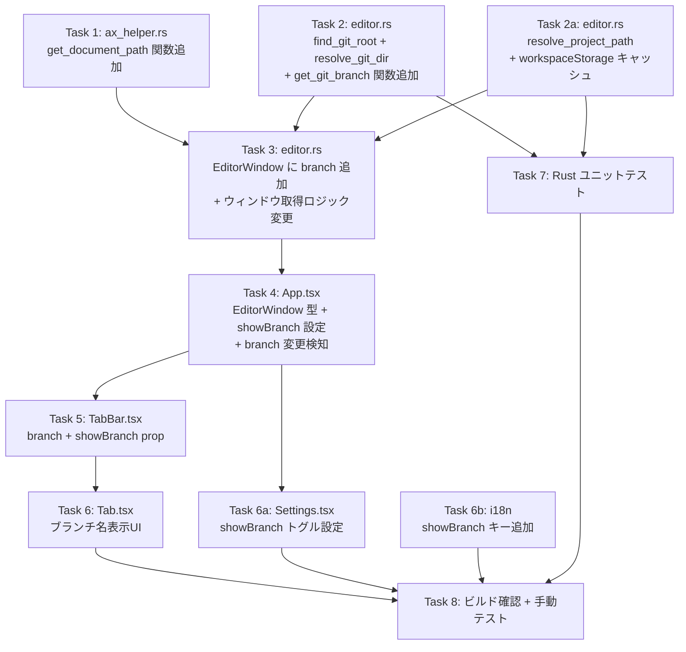

# 実装計画

## 参照ドキュメント

| ドキュメント | 説明 |
|---|---|
| [要件定義](./README.md) | 要件、データフロー、スコープ |
| [フロントエンド設計](./frontend-spec.md) | Tab コンポーネントへのブランチ名表示 + バックエンド変更 |
| api-spec.md | 該当なし（既存コマンドの拡張のみ） |
| db-spec.md | 該当なし（DB変更なし） |

## 実装タスク

| # | タスク | 依存 | 対象ファイル | 見積 |
|---|-------|------|------------|------|
| 1 | ax_helper.rs に get_document_path 関数追加 | - | `src-tauri/src/ax_helper.rs` | M |
| 2 | editor.rs に find_git_root + resolve_git_dir + get_git_branch 関数追加 | - | `src-tauri/src/editor.rs` | S |
| 2a | editor.rs に resolve_project_path + workspaceStorage キャッシュ機構追加 | - | `src-tauri/src/editor.rs`, `src-tauri/Cargo.toml` | M |
| 3 | EditorWindow に branch 追加 + ウィンドウ取得ロジック変更 | #1, #2, #2a | `src-tauri/src/editor.rs` | M |
| 4 | EditorWindow 型に branch フィールド追加 + showBranch 設定状態管理 + branch 変更検知 | #3 | `src/App.tsx` | M |
| 5 | Tab コンポーネントへ branch prop 受け渡し + showBranch 制御 | #4 | `src/components/TabBar.tsx` | S |
| 6 | ブランチ名表示UI実装 | #5 | `src/components/Tab.tsx` | M |
| 6a | Settings に showBranch トグル設定UI追加 | #4 | `src/components/Settings.tsx` | S |
| 6b | i18n に showBranch 設定のキー追加 | - | `src/i18n/locales/ja.json`, `src/i18n/locales/en.json` | S |
| 7 | Rust ユニットテスト | #2, #2a | `src-tauri/src/editor.rs` | M |
| 8 | ビルド確認 + 手動テスト | #6, #6a, #6b, #7 | - | M |

### 依存関係図



### 見積基準

- **S**: 1ファイル、30行以下の変更
- **M**: 1-2ファイル、100行以下の変更
- **L**: 複数ファイル、または100行以上の変更

### Task 1: ax_helper.rs - get_document_path 関数追加

**ファイル**: `src-tauri/src/ax_helper.rs`

**内容**: AXUIElement から AXDocument 属性を取得し、ファイルパスを返す新規関数を追加する。

- `get_document_path(pid: i32, target_window_id: u32) -> Option<String>` を新規作成
- AXUIElement::application(pid) でアプリ要素を取得
- windows() で全ウィンドウを取得し、CGWindowID が一致するウィンドウを探す
- AXDocument 属性を取得（AXUIElementCopyAttributeValue）
- `file://` プレフィックスを除去してファイルパスを返す
- 取得失敗時は None を返す

**依存**: なし（Task 2 と並行可能）

**パターン参照**: 「既存の `is_window_minimized_by_id`（`src-tauri/src/ax_helper.rs`）の AXUIElementCopyAttributeValue パターンに倣う」

### Task 2: editor.rs - find_git_root + resolve_git_dir + get_git_branch 関数追加

**ファイル**: `src-tauri/src/editor.rs`

**内容**: Git ブランチ名を取得するための3つの新規関数を追加する。

- `find_git_root(start_path: &Path) -> Option<PathBuf>`: パスから上位に向かって `.git` ディレクトリ/ファイルを探索し、git root を返す
- `resolve_git_dir(git_root: &Path) -> Option<PathBuf>`: `.git` の実体ディレクトリを解決（サブモジュール対応）
- `get_git_branch(git_root: &Path) -> Option<String>`: `resolve_git_dir` 経由で `.git/HEAD` ファイルを読んでブランチ名を返す
  - `ref: refs/heads/main` 形式 → `"main"` を返す
  - コミットハッシュ（detached HEAD） → 先頭7文字を返す
  - 読み取り失敗 → None を返す

**依存**: なし（Task 1, Task 2a と並行可能）

**備考**: git コマンドに依存せず、ファイル読み取りのみで高速に動作する

### Task 2a: editor.rs - resolve_project_path + workspaceStorage キャッシュ機構追加

**ファイル**: `src-tauri/src/editor.rs`, `src-tauri/Cargo.toml`

**内容**: プロジェクト名からフルパスを解決する多段フォールバック機構を追加する。

- `resolve_project_path`: 多段フォールバック（1. キャッシュ → 2. workspaceStorage → 3. サブディレクトリ検索 → 4. AXDocument）
- `get_workspace_storage_dir` / `load_workspace_paths`: workspaceStorage からプロジェクトパスを一括読み込み
- `percent_decode`: URL パーセントエンコーディングのデコード
- `PROJECT_PATH_CACHE` / `CACHE_INITIALIZED`: `lazy_static` グローバルキャッシュ
- Cargo.toml に `dirs = "5"`, `tempfile = "3"` (dev) を追加

**依存**: なし（Task 1, Task 2 と並行可能）

### Task 3: editor.rs - EditorWindow に branch 追加 + ウィンドウ取得ロジック変更

**ファイル**: `src-tauri/src/editor.rs`

**内容**: EditorWindow struct の拡張と、ウィンドウ取得時のブランチ名取得ロジックを追加する。

- EditorWindow struct に `pub branch: Option<String>` フィールドを追加
- `get_editor_state_with_config` 関数: ウィンドウ生成時に `resolve_project_path` → `find_git_root` → `get_git_branch` を呼び出し、`branch` フィールドに設定
- `get_editor_windows_with_config` 関数: 同上

```rust
let branch = resolve_project_path(&name, config.id, pid, *window_id)
    .and_then(|path| find_git_root(&path).or(Some(path)))
    .and_then(|git_root| get_git_branch(&git_root));
```

**依存**: Task 1, Task 2, Task 2a

### Task 4: App.tsx - EditorWindow 型に branch 追加 + showBranch 設定状態管理 + branch 変更検知

**ファイル**: `src/App.tsx`

**内容**:

1. EditorWindow interface に `branch?: string` を追加
2. `showBranch` state を追加（デフォルト: true）、Store から初期値読み込み
3. `handleShowBranchToggle` ハンドラ追加（State 更新 + Store 永続化）
4. `refreshWindows` / `fetchWindows` のウィンドウ変更検知に `branch` の比較を追加
5. TabBar に `showBranch` prop を渡す
6. Settings に `showBranchEnabled` / `onShowBranchToggle` props を渡す

**依存**: Task 3（バックエンド変更後）

### Task 5: TabBar.tsx - branch + showBranch prop 受け渡し

**ファイル**: `src/components/TabBar.tsx`

**内容**:

1. TabBarProps に `showBranch?: boolean` を追加
2. Tab への branch 渡し: `branch={showBranch !== false ? tab.branch : undefined}`

**依存**: Task 4

### Task 6: Tab.tsx - ブランチ名表示UI

**ファイル**: `src/components/Tab.tsx`

**内容**: タブ内にGitブランチ名を2行目として表示するUI変更を行う。

- TabProps に `branch?: string` を追加
- `tabTextContent` ラッパー div を追加（flex-direction: column）
- `branchName` span を追加（`branch` がある場合のみ条件レンダリング）
- `tabName` スタイルから `flex: 1` を `tabTextContent` に移動
- 新規スタイル: `tabTextContent`（flex column, overflow hidden, flex 1, minWidth 0）, `branchName`（fontSize 10px, color rgba(255,255,255,0.5), ellipsis）

**依存**: Task 5

**パターン参照**: 「既存の `claudeStatus` バッジ（`src/components/Tab.tsx`）の条件レンダリングパターンに倣う」

### Task 6a: Settings.tsx - showBranch トグル設定UI追加

**ファイル**: `src/components/Settings.tsx`

**内容**:

1. SettingsProps に `showBranchEnabled: boolean` / `onShowBranchToggle: (enabled: boolean) => void` を追加
2. 自動起動設定の下、言語設定の上にトグルカードを追加（既存の switchRow パターンを再利用）

**依存**: Task 4

### Task 6b: i18n に showBranch 設定のキー追加

**ファイル**: `src/i18n/locales/ja.json`, `src/i18n/locales/en.json`

**内容**:

| キー | ja | en |
|------|----|----|
| `settings.showBranchLabel` | Gitブランチ名を表示 | Show Git Branch |
| `settings.showBranchDescription` | タブにGitブランチ名を表示します | Display Git branch name on tabs |

**依存**: なし

### Task 7: Rust ユニットテスト

**ファイル**: `src-tauri/src/editor.rs`（`#[cfg(test)] mod tests`）

**内容**: find_git_root, resolve_git_dir, get_git_branch, resolve_project_path 関連のユニットテストを追加する。

| テスト | 検証内容 |
|--------|---------|
| find_git_root: 正常系 | gitリポジトリ内のパスで git root パスを返す |
| find_git_root: 非git | 非gitディレクトリ（tempdir）で None を返す |
| get_git_branch: 通常ブランチ | `ref: refs/heads/main` → `"main"` |
| get_git_branch: feature ブランチ | `ref: refs/heads/feature/user/login` → `"feature/user/login"` |
| get_git_branch: detached HEAD | コミットハッシュ → 先頭7文字 |
| get_git_branch: 失敗 | `.git/HEAD` がない → None |
| get_git_branch: サブモジュール | `.git` ファイル（gitdir 参照）→ 参照先の HEAD からブランチ取得 |
| resolve_git_dir: 通常 | `.git` ディレクトリをそのまま返す |
| resolve_git_dir: サブモジュール | `.git` ファイルの gitdir 参照先を解決 |
| percent_decode: 基本 | `hello%20world` → `hello world` |
| percent_decode: 日本語 | `%E3%83%86%E3%82%B9%E3%83%88` → `テスト` |
| load_workspace_paths: 非対応 | Zed等の非対応エディタで空を返す |
| get_workspace_storage_dir | 各エディタの正しいパスを返す |

**依存**: Task 2, Task 2a

**コマンド**: `cargo test --manifest-path src-tauri/Cargo.toml`

### Task 8: ビルド確認 + 手動テスト

**内容**: 全タスク完了後のビルド確認と手動テストを実施する。

**依存**: Task 6, Task 7

**確認コマンド**:

```bash
cargo check --manifest-path src-tauri/Cargo.toml
cargo clippy --manifest-path src-tauri/Cargo.toml
cargo test --manifest-path src-tauri/Cargo.toml
pnpm tauri dev
```

## 影響範囲・リスク

### 影響を受ける既存機能

| 既存機能 | 影響内容 | リスク | 対策 |
|---------|---------|-------|------|
| EditorWindow struct (Rust) | Optional フィールド `branch` 追加 | 低 | Serialize で None → null。既存コマンドに影響なし |
| EditorWindow interface (TS) | Optional フィールド `branch?` 追加 | 低 | 既存の tab.name, tab.id 参照に影響なし |
| Tab.tsx レンダリング | tabName の flex:1 を tabTextContent に移動 | 中 | レイアウト確認必要（ドラッグ、カラー、バッジとの共存） |
| ax_helper.rs | 新規関数 get_document_path 追加のみ | 低 | 既存関数に変更なし |
| Settings.tsx | showBranch トグル設定を追加 | 低 | 既存設定のレイアウトに影響なし |
| TabBar.tsx | showBranch prop 追加 + branch 渡しロジック変更 | 低 | showBranch 未指定時はデフォルト動作（表示） |
| App.tsx refreshWindows/fetchWindows | branch 変更検知を追加 | 低 | 既存の name 変更検知に追加のみ |
| Cargo.toml | dirs, tempfile 依存追加 | 低 | 既存クレートとの衝突なし |

### 後方互換性

- EditorWindow への `branch` フィールド追加は全て Optional（Rust: `Option<String>`, TS: `branch?: string`）のため、既存コードに影響なし
- 既存の Tauri コマンドのシグネチャ変更なし。返却値に新規フィールドが追加されるのみ
- フロントエンド側は `branch` が undefined の場合にブランチ行を非表示にするため、バックエンド未更新時も正常に動作

### パフォーマンスへの影響

- `.git/HEAD` ファイル読み取りは高速（git コマンド不使用）
- ウィンドウ数は通常5個以下のため、ファイルI/Oのオーバーヘッドは無視できるレベル
- `find_git_root` の上位ディレクトリ探索は最大でルートディレクトリまでだが、通常は2-3階層で見つかる

## テスト方針

### 自動テスト

| テストファイル | テスト内容 | 種別 |
|-------------|---------|------|
| `src-tauri/src/editor.rs` (#[cfg(test)]) | find_git_root: gitリポジトリ内のパスで git root パスを返す | unit |
| `src-tauri/src/editor.rs` (#[cfg(test)]) | find_git_root: 非gitディレクトリ（tempdir）で None を返す | unit |
| `src-tauri/src/editor.rs` (#[cfg(test)]) | get_git_branch: `ref: refs/heads/main` → `"main"` | unit |
| `src-tauri/src/editor.rs` (#[cfg(test)]) | get_git_branch: `ref: refs/heads/feature/user/login` → `"feature/user/login"` | unit |
| `src-tauri/src/editor.rs` (#[cfg(test)]) | get_git_branch: detached HEAD → コミットハッシュ先頭7文字 | unit |
| `src-tauri/src/editor.rs` (#[cfg(test)]) | get_git_branch: `.git/HEAD` がない → None | unit |
| `src-tauri/src/editor.rs` (#[cfg(test)]) | get_git_branch: サブモジュール（.git ファイル → gitdir 参照） | unit |
| `src-tauri/src/editor.rs` (#[cfg(test)]) | resolve_git_dir: 通常の .git ディレクトリ | unit |
| `src-tauri/src/editor.rs` (#[cfg(test)]) | resolve_git_dir: サブモジュールの .git ファイル → 実体解決 | unit |
| `src-tauri/src/editor.rs` (#[cfg(test)]) | percent_decode: 基本（スペース等） | unit |
| `src-tauri/src/editor.rs` (#[cfg(test)]) | percent_decode: 日本語 UTF-8 | unit |
| `src-tauri/src/editor.rs` (#[cfg(test)]) | load_workspace_paths: 非対応エディタで空を返す | unit |
| `src-tauri/src/editor.rs` (#[cfg(test)]) | get_workspace_storage_dir: 各エディタの正しいパス | unit |

### 手動検証チェックリスト

- [ ] Gitリポジトリのプロジェクトでブランチ名が表示される
- [ ] 非Gitリポジトリのプロジェクトでブランチ行が非表示
- [ ] ブランチ切り替え後、タブ切り替えで表示が更新される
- [ ] 長いブランチ名が省略表示（ellipsis）される
- [ ] Claude Status バッジとの共存（表示が崩れない）
- [ ] タブカラーとの共存（カラー表示が崩れない）
- [ ] ドラッグ&ドロップが正常に動作する
- [ ] 新規ウィンドウ（ファイル未開）でブランチ行が非表示
- [ ] Settings で showBranch トグル OFF → ブランチ行が非表示
- [ ] Settings で showBranch トグル ON → ブランチ行が再表示
- [ ] showBranch 設定がアプリ再起動後も保持される

### ビルド確認

```bash
cargo check --manifest-path src-tauri/Cargo.toml   # 型チェック
cargo clippy --manifest-path src-tauri/Cargo.toml   # Lint
cargo test --manifest-path src-tauri/Cargo.toml     # テスト実行
pnpm tauri dev                                       # 動作確認
```
