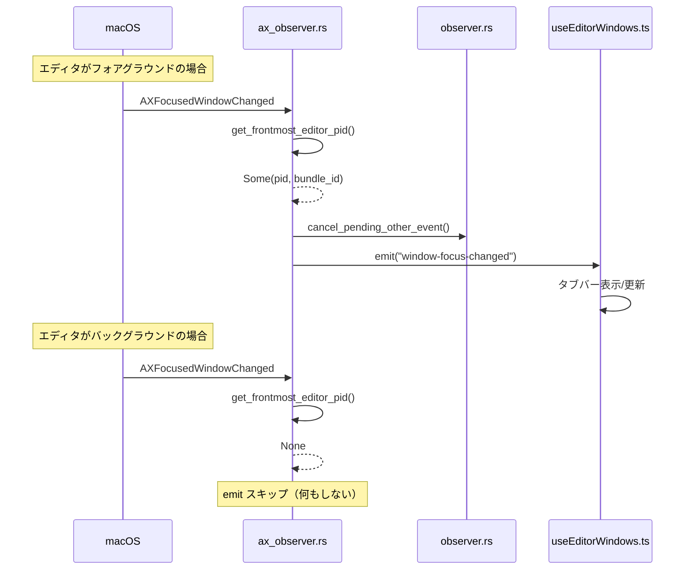

# タブバーがアプリ切替時に表示されたままになるバグの修正

## 1. 概要

エディタ以外のアプリ（フルスクリーンブラウザ含む）に切り替えた際、タブバーが「たまに」表示されたままになるバグを修正する。

### 原因

macOS はバックグラウンドのエディタプロセスに対しても `AXFocusedWindowChanged` を発火することがある（スリープ復帰時、ウィンドウサーバーの内部状態変更時など）。現在の `ax_observer.rs` のコールバックは「AX イベント＝エディタがアクティブ」と仮定しているため、バックグラウンドの AX イベントでも `window-focus-changed` を emit してしまい、フロントエンドが誤ってタブバーを再表示する。

### 修正方針

`ax_observer.rs` の `ax_observer_callback` 内で `get_frontmost_editor_pid()` を呼び、エディタがフォアグラウンドでない場合は `window-focus-changed` の emit をスキップする。Approach 6 のフォールバック復帰機構を維持しつつ、誤発火を防ぐ。

## 2. スコープ

### やること

- `ax_observer.rs` の `K_AX_FOCUSED_WINDOW_CHANGED` ブランチにフォアグラウンド確認ガードを追加
- `cancel_pending_other_event()` をガード内に移動（バックグラウンド AX イベントでの誤キャンセル防止）
- `get_frontmost_editor_pid()` の `#[allow(dead_code)]` 除去

### やらないこと

- フロントエンド側の変更（Rust 側で根本対処するため二重修正は不要）
- `observer.rs` の変更
- 副次原因の修正（小さいウィンドウ問題、コールドスタートギャップ）

## 3. 受入条件

| # | 条件 | 検証方法 |
|---|------|----------|
| AC-1 | エディタ以外のアプリ（フルスクリーンブラウザ含む）に切り替えた後、バックグラウンドの AXFocusedWindowChanged でタブバーが再表示されない | 手動テスト |
| AC-2 | エディタがフォアグラウンドの時は window-focus-changed が正常に emit され、Approach 6 のフォールバック機構が維持される | 手動テスト |
| AC-3 | cancel_pending_other_event() がバックグラウンド AX イベントで呼ばれない | コードレビュー |
| AC-4 | cargo check / cargo clippy が警告なしでパスする | CI / ローカル実行 |

## 4. データフロー

### 修正後のイベントフロー



### 判定ロジック

```
AXFocusedWindowChanged 受信
  → get_frontmost_editor_pid() で frontmostApplication を確認
    → Some(pid, bundle_id): エディタがフォアグラウンド
      → cancel_pending_other_event()
      → window-focus-changed を emit
    → None: エディタがフォアグラウンドでない
      → 何もしない（emit スキップ）
```

## 5. バックエンド変更

### 変更ファイル

| ファイル | 変更内容 |
|---------|---------|
| `src-tauri/src/ax_observer.rs` | コールバック関数のガード追加、`#[allow(dead_code)]` 除去 |

### ax_observer.rs の変更詳細

#### ax_observer_callback (L133-139)

`K_AX_FOCUSED_WINDOW_CHANGED` ブランチの修正:

| 項目 | 修正前 | 修正後 |
|------|--------|--------|
| フォアグラウンド確認 | なし（無条件で emit） | `get_frontmost_editor_pid()` で確認 |
| cancel_pending_other_event() | 無条件で呼び出し | ガード内（エディタがフォアグラウンドの場合のみ） |
| window-focus-changed emit | 無条件で emit | ガード内（エディタがフォアグラウンドの場合のみ） |
| None の場合 | - | 早期リターン（何もしない） |

#### get_frontmost_editor_pid() (L303-314)

- `#[allow(dead_code)]` アノテーションを除去
- 関数本体の変更なし
- `NSWorkspace::sharedWorkspace().frontmostApplication()` を使用（AppleScript 不要、低コスト）

### 依存関数

| 関数 | ファイル | 用途 |
|------|---------|------|
| `get_frontmost_editor_pid()` | `ax_observer.rs:L303-314` | フォアグラウンドアプリがサポート対象エディタかを判定 |
| `cancel_pending_other_event()` | `observer.rs` | デバウンス中の "other" イベントをキャンセル |
| `is_supported_editor()` | `ax_observer.rs` | bundle_id がサポート対象エディタかを判定 |

## 6. フロントエンド変更

変更なし。

Rust 側で `window-focus-changed` の誤発火を根本対処するため、フロントエンド側の修正は不要。既存の `useEditorWindows.ts` の `window-focus-changed` ハンドラ（Approach 4, 6）はそのまま維持される。

## 7. 設計判断

| # | 判断 | 理由 |
|---|------|------|
| D-1 | アプローチB（Rust 側ガード）を採用 | Approach 6 のフォールバック復帰機構を維持するため。フロントエンド側ガード（アプローチA）では Approach 6 が無効化される |
| D-2 | 既存の `get_frontmost_editor_pid()` を再利用 | 新規関数不要。NSWorkspace API の直接呼び出しで低コスト |
| D-3 | `cancel_pending_other_event()` もガード内に移動 | バックグラウンド AX イベントで正当な "other" イベント（非表示処理）がキャンセルされるのを防止 |
| D-4 | フロントエンド変更なし | Rust 側で根本対処するため二重修正は不要 |

## 8. テスト方針

| # | カテゴリ | テスト内容 | 対応AC |
|---|---------|-----------|--------|
| T-1 | ビルド検証 | `cargo check --manifest-path src-tauri/Cargo.toml` が警告なしでパス | AC-4 |
| T-2 | Lint 検証 | `cargo clippy --manifest-path src-tauri/Cargo.toml` が警告なしでパス | AC-4 |
| T-3 | 手動テスト | エディタ → フルスクリーンブラウザ切替後にタブバーが非表示のままであること | AC-1 |
| T-4 | 手動テスト | エディタ間の切替でタブバーが正常に表示されること | AC-2 |
| T-5 | 手動テスト | スリープ復帰後にエディタがフォアグラウンドならタブバーが表示されること | AC-2 |
| T-6 | コードレビュー | `cancel_pending_other_event()` がガード内でのみ呼ばれること | AC-3 |

## 9. 影響範囲

| ファイル | 影響 |
|---------|------|
| `src-tauri/src/ax_observer.rs` | コールバック関数のみ変更（6行程度） |
| `src-tauri/src/observer.rs` | 変更なし（`cancel_pending_other_event()` の呼び出し元が変わるのみ） |
| `src/hooks/useAppLifecycle.ts` | 変更なし |
| `src/hooks/useEditorWindows.ts` | 変更なし |

## 10. 実装タスク

| # | タスク | 対象ファイル | 見積 |
|---|--------|-------------|------|
| T1 | `ax_observer_callback` の `K_AX_FOCUSED_WINDOW_CHANGED` ブランチに `get_frontmost_editor_pid()` ガードを追加。`cancel_pending_other_event()` と `window-focus-changed` emit をガード内に移動。`get_frontmost_editor_pid()` の `#[allow(dead_code)]` を除去 | `src-tauri/src/ax_observer.rs` | 15min |

### 依存関係

なし（単一タスク）

## 11. 参考資料

- [リサーチ: タブバーがアプリ切替時に表示されたままになるバグの原因調査](./research-2026-03-12-tabbar-visibility-bug.md)
