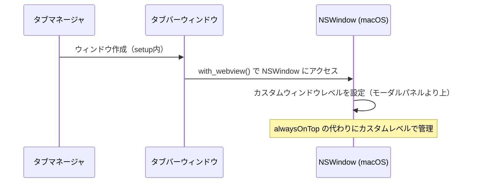
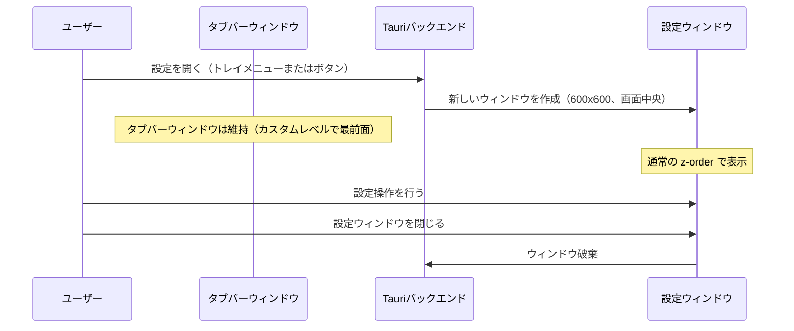
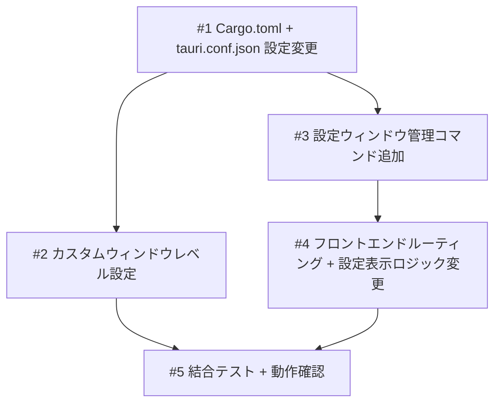

# タブバー z-order 修正 + 設定画面の別ウィンドウ分離

## 概要

エディタ（VSCode, Cursor, Zed）の使用中に設定画面やモーダルパネルなどのサブウィンドウが表示されると、タブバーがそれらのウィンドウの背面に隠れてしまう。タブバーウィンドウの z-order（NSWindowLevel）をカスタム値に変更し、エディタのすべてのサブウィンドウより上に表示されるようにする。あわせて、タブマネージャの設定画面を別ウィンドウとして分離し、設定表示中もタブバーが維持されるようにする。

## 受入条件

- [x] AC-1: エディタの設定画面やモーダルパネルが開いても、タブバーが隠れずに最前面に表示される
- [x] AC-2: エディタ以外のアプリに切り替えた際、画面幅の85%以上を占めるウィンドウの場合はタブバーが非表示になる。小さいウィンドウ（macOS設定等）ではタブバーが表示を維持する
- [x] AC-3: タブマネージャの設定画面を開いても、タブバーが消えずに画面上部に表示され続ける
- [x] AC-4: 設定画面を閉じた後、タブバーが正常に動作する
- [x] AC-5: オンボーディング画面表示中はメインウィンドウ内で表示（初回起動時のみのため許容）

## スコープ

### やること

- タブバーウィンドウの NSWindowLevel をカスタム設定に変更（NSModalPanelWindowLevel より上）
- tauri.conf.json の alwaysOnTop 設定を削除し、Rust コードで直接 NSWindowLevel を制御
- Cargo.toml の objc2-app-kit features に NSWindow を追加
- 設定画面を別ウィンドウとして作成するバックエンドコマンドの追加
- フロントエンドに URL パラメータベースのルーティング追加（タブバーウィンドウと設定ウィンドウの表示切替）
- 設定画面表示時のウィンドウリサイズロジックの削除

### やらないこと

- 他アプリ切替時の非表示動作の変更（y=-10000 による画面外退避はそのまま維持）
- エディタウィンドウ側の z-order 操作
- 設定 UI の内容変更（見た目はそのまま）

## 非機能要件

特になし

## データフロー

### アプリ起動時のウィンドウレベル設定



### 設定画面の表示



## バックエンド変更

### API設計

- 設定ウィンドウの作成コマンドを提供する。show-settings イベント受信時に呼び出し、設定ウィンドウが未作成であれば新規作成し、既に存在する場合は前面に持ってくる
- 設定ウィンドウの作成パラメータとして、URLにビューパラメータ（settings）を付与したフロントエンドを読み込む
- 設定ウィンドウの属性は通常の z-order（alwaysOnTop なし）、装飾あり、サイズ 600x600、画面中央配置
- タブバーウィンドウの NSWindowLevel 設定は setup 内で with_webview() を使い、NSModalPanelWindowLevel（値: 8）より高いカスタムレベル（値: 9 以上）を設定する
- tauri.conf.json から alwaysOnTop: true を削除し、ウィンドウレベルは Rust コードで直接制御する

### 対象ファイル

- 変更: `src-tauri/src/lib.rs` — setup 内にウィンドウレベル設定ロジックを追加。設定ウィンドウの作成・管理コマンドを追加。トレイメニューの settings クリック時に別ウィンドウを作成するよう変更
- 変更: `src-tauri/tauri.conf.json` — ウィンドウ定義から alwaysOnTop: true を削除
- 変更: `src-tauri/Cargo.toml` — objc2-app-kit の features に NSWindow を追加
- 変更: `src-tauri/capabilities/default.json` — windows に設定ウィンドウのラベルを追加し、必要な権限を付与

## フロントエンド変更

### 画面・UI設計

- メインウィンドウ（URL パラメータなし）ではタブバー UI をそのまま表示する
- 設定ウィンドウ（URL パラメータ ?view=settings）では Settings コンポーネントを表示する
- URL パラメータに基づいて TabBar と Settings の表示を切り替えるルーティングロジックを追加する
- 設定画面の閉じるボタンは、ウィンドウリサイズではなくウィンドウ自体を閉じる操作に変更する
- useAppLifecycle の show-settings リスナーは、ウィンドウリサイズの代わりにバックエンドコマンドで設定ウィンドウを作成する
- showSettings ステートによるフロントエンド管理を削除し、設定画面は別ウィンドウとして管理する

### ワイヤーフレーム

```
タブバーウィンドウ（常時表示、カスタム z-order）:
+--[Tab1]--[Tab2]--[Tab3]--[+]--+
|  タブバー（36px高）              |
+--------------------------------+

設定ウィンドウ（別ウィンドウ、必要時のみ表示）:
+--------------------------------+
|  Settings               [X]   |
+--------------------------------+
|  Settings | About              |
|                                |
|  Claude Code Integration       |
|  ...                           |
|                                |
+--------------------------------+
```

### 対象ファイル

- 変更: `src/App.tsx` — URL パラメータベースのルーティングロジックを追加。showSettings による条件分岐を URL ベースの分岐に変更
- 変更: `src/hooks/useAppLifecycle.ts` — show-settings リスナーのウィンドウリサイズロジックを削除し、バックエンドコマンドによる設定ウィンドウ作成に変更。showSettings ステートおよび handleSettingsClose を削除
- 変更: `src/components/Settings.tsx` — 閉じるボタンの動作を、親コンポーネントへのコールバックからウィンドウを閉じる操作に変更

## 設計判断

| 判断事項 | 選択 | 理由 | 検討した代替案 |
|---------|------|------|--------------|
| ウィンドウレベル設定方法 | with_webview() で NSWindow に直接アクセスしカスタムレベルを設定 | Tauri 2 の高レベル API では細かいレベル指定ができない。macOSPrivateApi は既に有効であり、with_webview() が利用可能 | Tauri の set_always_on_top() を使い続ける方法。ただしレベル 3（floating window）固定のため、NSModalPanelWindowLevel（8）より低く不十分 |
| 設定画面の分離方式 | 別ウィンドウ方式 | タブバーの可視性を維持する最もシンプルな方法。タブバーウィンドウのサイズやポジションを変更する必要がなく、表示状態を安定して維持できる | 同一ウィンドウでのオーバーレイ表示。ウィンドウサイズの動的変更が必要になり、UI が複雑化する。現状の問題の根本原因でもある |
| ルーティング方式 | URL パラメータ（?view=settings） | Tauri のマルチウィンドウで同一フロントエンドバンドルを再利用でき、追加ライブラリが不要。ビルド設定の変更も不要 | 別 HTML ファイルを用意する方法。Vite のマルチエントリー設定が必要になり大掛かり |

## システム影響

### 影響範囲

- `src-tauri/src/lib.rs`: setup 処理にウィンドウレベル設定を追加、設定ウィンドウ管理コマンドを追加、トレイメニューのイベントハンドラを変更
- `src-tauri/tauri.conf.json`: alwaysOnTop 設定の削除
- `src-tauri/Cargo.toml`: objc2-app-kit の features 拡張
- `src-tauri/capabilities/default.json`: 設定ウィンドウ用の権限追加
- `src/hooks/useAppLifecycle.ts`: 設定表示・非表示のウィンドウリサイズロジック削除、showSettings ステート削除
- `src/App.tsx`: URL ベースのルーティング追加、showSettings による条件分岐削除
- `src/components/Settings.tsx`: 閉じるボタンの動作変更
- `src-tauri/src/observer.rs`: 影響なし（app-activated イベント発火はそのまま）

### リスク

- NSWindowLevel のカスタム値が特定のエディタバージョンのウィンドウレベルと競合する可能性がある。エディタが独自に高いウィンドウレベルを使用している場合、タブバーが隠れる可能性は残る
- Tauri の内部実装が変わった場合に with_webview() の動作が変わる可能性がある（macOS Private API 依存）
- マルチウィンドウ化により、設定ウィンドウでの Store 操作（言語変更、通知設定等）がタブバーウィンドウに即座に反映されない可能性がある。必要に応じてウィンドウ間のイベント通知を検討する

## 実装タスク

### 依存関係図



### タスク一覧

| # | タスク | 対象ファイル | 見積 | 依存 |
|---|--------|------------|------|------|
| 1 | Cargo.toml に NSWindow feature 追加、tauri.conf.json の alwaysOnTop 削除 | `src-tauri/Cargo.toml`, `src-tauri/tauri.conf.json` | S | - |
| 2 | lib.rs の setup 内にカスタムウィンドウレベル設定ロジックを追加 | `src-tauri/src/lib.rs` | M | #1 |
| 3 | lib.rs に設定ウィンドウ作成・管理コマンドを追加、トレイメニューのハンドラを変更、capabilities に設定ウィンドウの権限を追加 | `src-tauri/src/lib.rs`, `src-tauri/capabilities/default.json` | M | #1 |
| 4 | フロントエンドに URL パラメータベースのルーティングを追加、useAppLifecycle の設定表示ロジックを変更、Settings の閉じるボタン動作を変更 | `src/App.tsx`, `src/hooks/useAppLifecycle.ts`, `src/components/Settings.tsx` | M | #3 |
| 5 | 結合テスト、全受入条件の手動検証 | 全体 | M | #2, #4 |

> 見積基準: S(〜1h), M(1-3h), L(3h〜)

## テスト方針

### トレーサビリティ

| 受入条件 | 自動テスト | 手動検証 |
|---------|-----------|---------|
| AC-1 | - | MV-1 |
| AC-2 | - | MV-2 |
| AC-3 | - | MV-3 |
| AC-4 | - | MV-4 |
| AC-5 | - | MV-5 |

### 自動テスト

ウィンドウレベルやマルチウィンドウの動作は macOS ネイティブ機能に依存するため、自動テストは限定的。ビルド確認で型チェックとコンパイルの通過を確認する。

### ビルド確認

```bash
cargo check --manifest-path src-tauri/Cargo.toml   # Rust コンパイル確認
cargo clippy --manifest-path src-tauri/Cargo.toml   # Rust lint
pnpm build                                          # フロントエンドビルド確認
pnpm test                                           # Vitest 既存テスト
```

### 手動検証チェックリスト

- [ ] MV-1: エディタ（Cursor/VSCode/Zed）の設定画面やモーダルパネルを開いた状態で、タブバーが上に表示されていること
- [ ] MV-2: エディタ以外のアプリ（Finder等）に切り替えた際、タブバーが他のアプリの前面に表示されないこと
- [ ] MV-3: トレイメニューから設定画面を開いた際、タブバーが消えずに画面上部に表示され続けること
- [ ] MV-4: 設定画面を閉じた後、タブバーが正常に動作すること（タブクリック、色変更等）
- [ ] MV-5: オンボーディング画面表示中もタブバーが維持されること
- [ ] MV-6: 設定画面で設定を変更した際、タブバーに反映されること（言語変更等）
- [ ] MV-7: アプリ再起動後もウィンドウレベルが正しく設定されること
